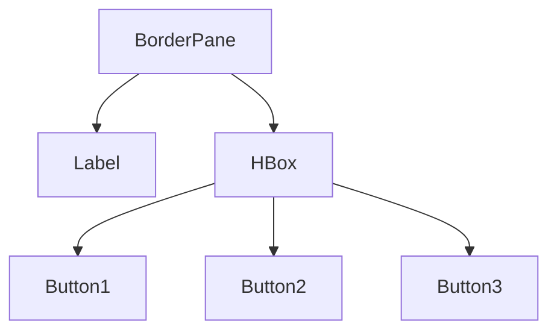
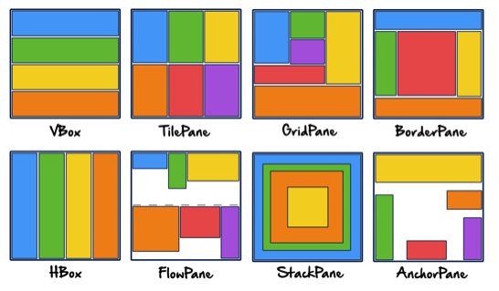

# Graphical User Interfaces

## Java toolkits for GUIS

+ Abstract Windowing Toolkit (AWT)
    + In principle portable
    + java wrappers around native platform libraries.
    + too much original behavior -> protability was lost.

+ Swing
    + Part of JFC java foundation classes.
    + Complete java GUI ues only native canvas, and draws java
    components onto it.

+ JavaFX
    + software platform for creating and delivering desktop applications
    + brings desktop applications closer to IRAs (Internet Rich Applications) which run on different devices.
    + Developed to replace Swing.
    + Not distributed with JDK 11.

## JavaFX

### Application
A class to represent a program with a GUI.

programs should extend `Application` and implement `main()` method.
In the main method, the application is launched.

### Stage and Scene
Application gets a `Stage` with the `start()` method, which represents a window on the screen (main window of a program)

new windows can be created be creating more `Stage` objects.

`Application` needs to fill in and show the main window.

A `Stage` shows a `Scene` which is a container for GUI components

Usage:
```java
// Pass the scene to the stage and show it
stage.setScene(scene);
stage.setTitle("JavaFX Test");
stage.show();
```

### Visual Example


### GUI Containers
A scene is a container for GUI components.
the components placed in scene can themselves be containers, this forms a *scene graph*

for Example:



```java
HBox buttonBar = new HBox(20, button1, button2, button3);
buttonBar.setAlignment(Pos.CENTER);

BorderPane root = new BorderPane();
root.setCenter(message);
root.setBottom(buttonBar);

Scene scene = new Scene(root, 450, 200);
```

### JavaFX layouts




## Event-Driven Programming

Events like pressing a button have to be handled.
An `Event ` contains information on what happened.
An `EventHandler` handles an `Event`.

```java
Button helloButton = new Button("Say Hello");
helloButton.setOnAction((new EventHandler<ActionEvent>() {
    public void handle(ActionEvent event) {
        System.out.println("Hello World");
    }
}));
```

### EventHandler
An `EventHandler` is a functional interface (defines a single function).
`handle(Event e)`, so it can be ued as a target for a *lambda expression*

```java
// lambda expressions
Button helloButton = new Button("Say Hello");
helloButton.setOnAction(e -> System.out.println("Hello World!"));
```