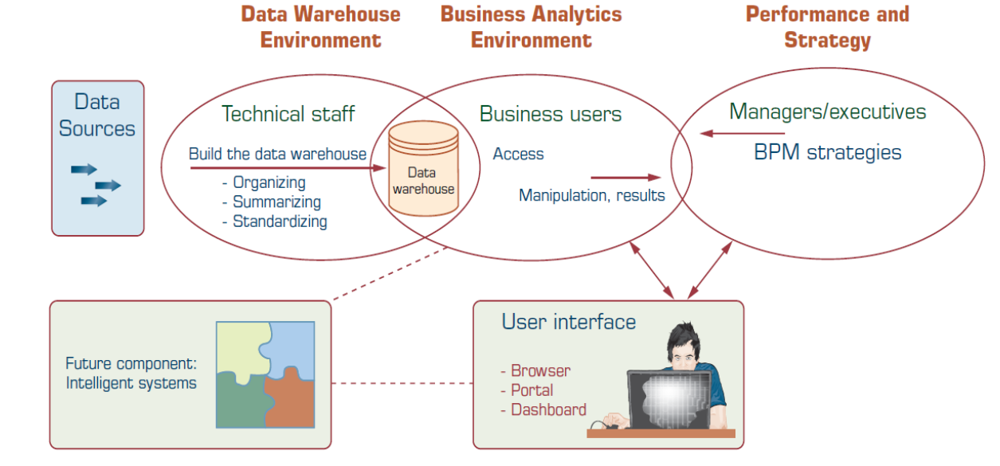
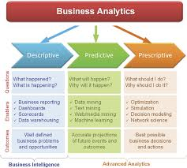

# Business Intelligence Introduction

::: info Business Intelligence
Category of apps, technology, databases, methodologies and processes
for gathering, storing, accessing and analyzing data to help businesses make better decisions.

+ Leverages software and services to transform data into actionable insights that inform an organization.
:::

The goal of BI is going from data to knowledge and the ability to make
business decisions based on the data.

## Why is BI necessary ?

Organizations have growing complexity
which must be managed.
To be able to handle this complexity organizations
must be modeled, designed and analysed. (engineered)

## Main Components of BI
+ Data Warehousing
+ Business Analytics
+ Business Performance Managemnent
+ User Interface

### Data Warehousing
Contains the `source data` from Enterprise systems.
Can contain `historical data` and/or `current data` to support
*real-time decision making*
In concrete terms a data warehouse is a central repository
of data that comes from one or more sources.

### Business Analytics
A collection of tools and techniques for
manipulating, mining and analyzing data. (provided by a data warehouse)

+ **Data Mining**: Process of searching for unknown patterns and relationships.
+ **Process Mining**: Supports the analysis of operational processes based on event logs.
+ **Artificial Intelligence** and **Machine Learning** Techniques can support prediction tasks.

Business analytics outputs static and/or dynamic reports and queries.
Business analytics can be classified in the types:

+ **Descriptive BI**: Insight from historical data with dashboards.
+ **Predictive BI**: Predicting future values with statistical and machine learning techniques.
+ **Prescriptive BI**: Recommends decisions using optimization, simulation, etc.

## Business Performance Management

Focused on the management, monitoring
and comparing of **Key Performance Indicators (KPI)**

