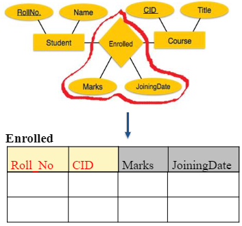

# Databases Introduction.

## File-based system and Database system

In a system we store **data** in order to obtain **information** out of it.

::: tip Data vs Information
+ **Data**:
No contextual meaning (just numbers and text)
Individual unit of information
Raw facts of things

+ **Information**
Data with exact meaning
Processed data and organized text
Is knowledge about a particular subject
:::

Data can be stored in a file, a file is an object on a computer that stores data or a resource on the computer for recording data.

We can store data and display information in two main ways:

- File-Based System
- Database System

### File-Based System

In a **File-Based System** data is stored in files which each has its specific format. It has several programmes which also define and manage their own data.

::: info File-Based System
A collection of application programs that perform services for the end users (such as production or sales)
:::

Problems with this traditional approach for storing data are:
::: warning Limitations

- Data redundancy: is the repetition or superfluity of data
- Data inconsistency: matching of data must be done between files (data could be changed in one place but not updated in the other place)

* Program data dependency: the close relationship between data stored in files and the software programs that update and maintain those files
* Lack of flexibility/fixed queries
* Poor data security: the data stored in the flat files can be easily accessible
* Limited data sharing
  :::

### Database System

Instead of a file based system a database system could be used. It serves many applications by centralizing data and controlling redundant data.
::: info Database System

- Organized collection of related data (dataset is centralized in database)
- Shared collection of related data
- Models a particular real-world system in the computer in the form of data.
- A collection of data arranged for ease and speed of search and retrieval.

:::

A database environment consists of 4 main components:

- Hardware
- Data
- Users
- Software

#### Hardware

A database server runs on a computer, just like it’s clients so it has processors, hard disks etc.

#### Data

A database environment contains two types of data:
::: tip

- Operational data
- System catalog (contains the information about the database objects)
  :::
  Operational data is for example data on an employee like name and salary.
  The system catalog stores:
- Names, types, and sizes of data items;
- Names of relationships;
- Integrity constraints on the data;
- Names of authorized users who have access to the data;
- External, conceptual, and internal schemas and the mappings between the schemas

#### Users

::: info Users

- Database Administrator (DBA): Designs & manages the database system
- Database Designer user: writes the database software itself
  +Application developer: writes software to allow end users to interface with the database system
- End user: uses the database system to achieve some goal
  :::

#### Software

::: info Software

- management system (DBMS): MySQL, Oracle etc.
- Operations system
- Application programs: computer program that a user can interact with the database (java, c++ C# etc.)
:::

## DataBase Management System (DBMS)

A DBMS is a software system that enables users to define, create, maintain, and control access to the database. It consists of software that organizes the storage of data and Interfaces between applications and physical data files.

A DBMS is divided into multiple Database Management System Facilities.

- Data definition language (DDL).
- Data manipulation language (DML).
- Data control language (DCL).

DBMS has multiple advantages like:

- data consistency
- sharing of data
- improved data integrity
- improved security

But also disadvantages like:

- Complexity
- Size
- Cost of DBMS
- Cost of conversion
- Performance
- Greater impact of a failure

## Three-level ANSI-SPARC Architecture

### ANSI-SPARC Architecture

ANSI stands for American National Standards Institute while SPARC stands for
Standards Planning and Requirements Committee. An ANSI-SPARC architecture is an abstract design standard for a Database Management System (DBMS).

### Three-level Architecture

A database architecture can be divided into three levels:

- External level: For database users
- Conceptual level: For database designers and administrators
- Internal level: For systems designers

## External level

This level is the users’view of the database. It describes the parts of the database that are relevant to a particular user like an Application programmer or end-user (also excludes irrelevant data as well as data which the user isn't authorized to access). This means that only data which is of interst to a particular user is displayed. There can be mutiple diffrent external views of a database. It's also the highest level of abstraction of the database.

## Conceptual level

This level is the community view of the database. It provides both the mapping and desiderd independence. The indentification of the important entities, relationships and attrubitues belongs on this level as it describes what data is stored and the relationships among the data. It should be complete and accurate representation of an organization’s data requirements.

### Conceptual Data base design

::: info Steps for design

- Identify entity types.
- Identify and associate attributes with entity.
- Identify the relationship among entities.
- Determine attribute domains.
- Determine candidate, primary, and alternate key attributes.
- Check model for redundancy.
- Review the conceptual data model with user.
- Integrity constraints.
  :::

**Logical level**
_To convert the conceptual representation to the logical structure of the database_

The objective of logical database design methodlolgy is to interpret the conceptual data model into a logical data model and then authorize this model to check whether it is structurally correct and able to support the required transactions or not. A logical design is the process of defining a system's data requirements and grouping elements into logical units.

A logical database design (logical data model):

- Validates realtions using normalization
- Checks intergriy constraints
- Reviews logical data models with the user
- Derives realtions for logical data models (RDBMS) (like name of relation, simple list of attributes, primery key etc.)

Normalization is:

- A technique used to test the correctness of a logical data model.
- A method to remove all anomalies (from insertion, modification and deletion).
- A database schema design technique, by which an existing schema is modified to minimize redundancy and dependency of data.

There are mutiple levels of normalization like First Normal Form (1NF), Second Normal Form (2NF) etc.

## Internal level

The internal level describes how the data is stored in the database.It deals with physical storage of data structure of records on disk. So it's a Physical representation of the database on the computer. In this level it's decided how the database is arranged on direct-access storage devices and how the logical structure is to be physically implemented.

### Physical database design

- Translate logical data model for target DBMS.
- Design general constraints.
- Analyze transactions.
- Design security mechanisms.
- Design base relations.
- Design representation of derived data.

## Data modelling

Data modeling is a concept used to define the DB structure (i.e. data items & types, reslationships, constraints), manipulation and integrity aspects of the data stored in relational databases. It ensures that all data objects are represented. There are many ways to do this but the two ways discussed in the lectures are Entity-relationship Model (ERM) and Relational Model (RM), these can easily be converted to each other.

### ER model

The ER model defines the conceptual view of a database as it shows the relationships between data. It has various notaions like Chen, Crow's Foot and UML class diagrams.

::: tip Main concepts

#### Entity-type

Represents a group of a real-world thing

- Strong: is not existence-dependent on some other entity type
- Weak: is existence-dependent on some other entity type

#### Attribute

Characteristics or properties of an entity

- Simple attribute:simple attributes are atomic values, which cannot be divided further.
- Composite attribute: composite attributes are made of more than one simple attribute.
- Single-value attribute: contains single value.
- Multi-value attribute: contains more than one values.
- Derived attribute: its value is derived from other attribute present in the database.

#### Relationship

Dependency or association between two or more entities. It can have 4 diffrent degrees:

- Unary/Recursive Relationship: A relationship type in which the same entity type participates more than once in different roles.
- Binary relationship: two entities are participating
- Ternary relationship: three entities are participating
- n-aryrelationship: a relationship set of degree ‘n’ is called the n-aryrelationship set.
  Each degree corresponds to a diffrent type of relationship:
- One-to-One relationship: When only one instance of an entity is associated with the relationship, it is marked as '1:1'.
- One-to-Many relationship: More than one instance of an entity on the right and only one instance on the left can be associated with the relationship. itismarkedas'1:N'.
- Many-to-One relationship: More than one instance of an entity on the left and only one instance on the right can be associated with the relationship. itismarkedas'N:1'.
- Many-to-Many relationship: More than one instance of an entity on the left and more than one instance on the right can be associated with the relationship. itismarkedas'N:N'.

These entities can both be involved in the relationship, or not:

- Total Participation− Each entity is involved in the relationship. Total participation is represented by double lines.
- Partial participation− Not all entities are involved in the relationship. Partial participation is represented by single lines.

#### Keys: to uniquely identify any record or row of data.

- Super Key: an attribute, or set of attributes, that uniquely identifies a tuple within a relation.
- Candidate Key: is the minimal number of attributes, whose value(s) uniquely identify each entity occurrence. It cannot be null or empty it value should be unique and there can be more than one per table. The key can be a combination of mutiple attributes (collumns)
- Primary Key: The candidate key that is selected to uniquely identify each occurrence of an entity type.
- Alternate Key: The candidate keys that are not selected to be the primary key
- Foreign Key: Is a key used to link two tables together. It's a field (or collection of fields) in one table that refers to the PRIMARY KEY in another table.
- Composite Key: A candidate key that consists of two or more attributes that uniquely identify any record in a table.
  :::

### Relational model

A relational model represents how data is stored in Relational Databases. A relational database stores data in the form of relations (tables). Relations are used to hold information about the objects to be represented in the database.

Common terms:

- Relation:A relation is a table with columns and rows.
- Attribute:An attribute is a named column of a relation.
- Domain:A domain is the set of allowable values for one or more attributes.
- Tuple:A tuple is a row of a relation.
- Degree:The number of attributes in the relation is known as degree of the relation
- Cardinality:The number of tuples in a relation is known as cardinality

::: info Properties of relations

- No two tuples are identical.
- Each attribute has a distinct name.
- The sequence/ordering of rows is not important.
- The sequence/ordering of columns is not important.
- Each column in a relation contains values from a same domain.
- Each cell of the relation contains exactly one atomic (single) value.
- A table has a name that is distinct from all other tables in the Database.
- Various operations can be performed on relations (insert, delete, modify).
  :::

While designing Relational Model, we define some conditions which must hold for data present in database are called Constraints. These conditions are called Relational Integrity Constraints and there are three of them:

- Key constraints.
  - In a relation with a key attribute, no two tuples can have identical values for key attributes.
  - A key attribute cannot have NULL values.
- Domain constraints.
  - An attribute can only take values which lie inside the domain range.
- Referential integrity constraints.
  - Referential integrity constraints work on the concept of Foreign Keys.
  - A foreign key is a key attribute of a relation that can be referred in another relation.

## ERM to RM

The process of converting between these two models is called diagram mapping.

::: tip

1. Create table for each entity.
2. Entity's attributes should become fields of tables with their respective data types.
3. Declare primary key
:::

