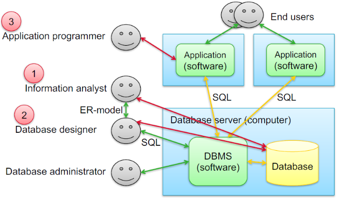
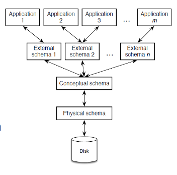

# Database Basics

## Algebra of tables

Examples of tables:

**Student**
| sid | name | address |
| --- | --- | --- |
| 415 | Peter Black | Matenweg 163 |
| 423 | John Brown | Calslaan 204 |
| 502 | Bill Green | Witbreuksweg 8 |
| 467 | Sarah White | Matenweg 163 |

**Grade**

| sid | course | grade |
| --- | --- | --- |
| 415 | PCS | 7 |
| 415 | SS | 6 |
| 415 | NS | 7 |
| 423 | IBIT | 8 |
| 423 | SS | 8 |
| 423 | BIIT | 6 |
| 502 | PCS | 6 |
| 502 | SS | 7 |
| 502 | NS | 8 |
| 467 | IBIT | 6 |
| 467 | SS | 5 |
| 467 | BIIT | 7 |

### Projection
*Projection* is an operation on tables which
produces a table as output that has less columns. A *projection* on the student table that
selects only the `sid` and `name` attributes would result in this output:

**Student**
| sid | name |
| --- | --- |
| 415 | Peter Black |
| 423 | John Brown |
| 502 | Bill Green |
| 467 | Sarah White |

### Selection
*Selection* is an operation on tables which produces a table with less rows (=tuples) than the input table. A *selection* on the grade table that selects only tuples with the course equal to `"SS"` would result in the following output:

| sid | course | grade |
| --- | --- | --- |
| 415 | SS | 6 |
| 423 | SS | 8 |
| 502 | SS | 7 |
| 467 | SS | 5 |

### Join

An essential characteristic of relational
databases is that operations that take table(s)
as input yield a table as output, this means that tables can be arbitrarily (in however way you like) combined.

This is the table where we combine
the tables Student and Grade by matching
the rows which have the same `sid`.
This is called a join it has this special
syntax in relational algebra:
$Student \bowtie_{sid} Grade$

And this is the table:

| sid | name        | address          | course | grade |
|-----|-------------|------------------|--------|-------|
| 415 | Peter Black | Matenweg 163     | PCS    | 7     |
| 415 | Peter Black | Matenweg 164     | SS     | 6     |
| 415 | Peter Black | Matenweg 165     | NS     | 7     |
| 423 | John Brown  | Calslaan 204     | IBIT   | 8     |
| 423 | John Brown  | Calslaan 205     | SS     | 8     |
| 423 | John Brown  | Calslaan 206     | BIIT   | 6     |
| 502 | Bill Green  | Witsbreuksweg 8  | PCS    | 6     |
| 502 | Bill Green  | Witsbreuksweg 9  | SS     | 7     |
| 502 | Bill Green  | Witsbreuksweg 10 | NS     | 8     |
| 467 | Sarah White | Matenweg 163     | IBIT   | 6     |
| 467 | Sarah White | Matenweg 164     | SS     | 5     |
| 467 | Sarah White | Matenweg 165     | BIIT   | 7     |


## Relational Algebra vs SQL

::: info Relational Algebra
Mathematical theory

*Terminology*:
+ Relation
+ Attribute
+ Tuple
+ Relation = Set of tuples
    + No order
    + No duplicates
:::

::: info SQL
Programming language

*Terminology*:
+ Table
+ Column
+ Row
+ Table = List of rows
    + Ordered
    + can have duplicates.
:::

## Environment of a database:



## ANSI-SPARC Architecture:

ANSI-SPARC is an abstract design standard for 
a database management system.

The ANSI-SPARC architecture aims to 
separate the structure of a RDBMS, such that 
external users do not need to deal with the physical database storage details. And changes to the physical storage do not affect the internal structure of the database.

There are three different types of schema corresponding to the three levels in the ANSI-SPARC architecture:

External Schemas, Conceptual Schema and Physical Schema.



## SQL

::: info SQL
Structured Query Language is a language used
for managing data stored in a relational database. It is based on relational algebra.
SQL has many types of commands that can be classified in "sub-languages":

+ **DDL** (Data Definition Language)
    + Creation and deletion of tables
    + Commands like: `CREATE`
+ **DML** (Data Manipulation Language)
    + Updating tables.
    + Commands like: `INSERT`, `UPDATE`
+ **DCL** (Data Control Language)
    + Giving permissions to users.
    + Commands like `GRANT`, `REVOKE`
+ **TCL** (Transaction Control Language)
    + Controlling the flow of a transaction.
    + Commands like `COMMIT`, `ROLLBACK`
+ **DQL** (Data Query Language)
    + Querying the data.
    + Like `SELECT`.
:::

### Creating Tables

Creating the *Student* and *Grade* tables:
```sql
-- creating the student table:
CREATE TABLE Student (
    sid INTEGER PRIMARY KEY,
    name TEXT,
    address TEXT
);

-- creating the grade table:
CREATE TABLE Grade (
    sid Integer,
    course TEXT,
    grade NUMERIC(2,0),
    
    PRIMARY KEY (sid,course)
);
```

### Inserting data

```sql
-- example for Student
INSERT INTO Student VALUES(415,'Peter Black','Matenweg 163');

-- examples for Grade
INSERT INTO Grade VALUES(415,'PCS',7);
INSERT INTO Grade VALUES(415,'SS',6);
INSERT INTO Grade VALUES(415,'NS',7);
```

### Projection

```sql
-- after the select specify which columns you want.
SELECT sid, name FROM Student;

-- * means all columns
SELECT * FROM Grade;
```


### Selection

```sql
-- Selection of only tuples that are a grade for the course SS
SELECT * FROM Grade
WHERE course = 'SS';

/* 
Selection of Students 
that have Sara at the beginning of their name.

Here we use the letter s as an alias for the Student table.
*/
SELECT * FROM Student s
WHERE s.name LIKE '%Sara';
```

### Join

the database engine will optimize queries by translating cartesian products into joins before executing it.

#### Inner Join

This is the syntax for an inner join
this will take put tuples together
when their student ids match.

```sql
SELECT s.sid, s.name, g.course, g.grade
FROM Student s
INNER JOIN Grade g ON s.sid = g.sid;
```

This is equivalent to doing this:

```sql
SELECT s.sid, s.name, g.course, g.grade
FROM Student s, Grade g
WHERE s.sid = g.sid;
```

#### Cartesian Product

This is the syntax for the cartesian product
the cartesian product just takes each tuple from table A and puts it next to all of table B's tuples.

```sql
SELECT *
FROM Student, Grade;
```

if the student table has 4 rows and the grade table has 12 rows then the cartesian product produces 4*12 = 48 rows.

#### Examples:

```sql
SELECT s1.name
FROM Student s1, Student s2
WHERE s1.address = s2.address
AND s2.name = 'Peter Black'
AND s1.sid <> s2.sid;
```

```sql
SELECT s1.name
FROM Student s1
WHERE NOT EXISTS (
-- student s2 with the
-- same address as s1
    SELECT s2.name
    FROM Student s2
    WHERE s1.sid <> s2.sid
    AND s1.address = s2.address
);
```

### Aggregate Functions

| Function Name | Output |
| ----- | ----- |
| AVG() | average of a column |
| COUNT() | count amount of tuples |
| MAX() | find largest instance of a column |
| MIN() | find smallest instance of a column |
| SUM() | add all the rows of a column together |

#### Examples:

```sql
-- How many students are in the database:
SELECT count(*) FROM Student;

-- What is the highest registered student number:
SELECT MAX(sid) FROM Student;
```
### Group By

The `GROUP BY` statement groups rows that have the same values into summary rows. It is often used with aggregate functions.

```sql
-- average grade of each student:
SELECT g.sid, AVG(g.grade)
FROM Grade g
GROUP BY g.sid;
```

::: warning
Selected attributes must either be in the "group by" clause or used in  an aggregate function.
:::

### Having

The `HAVING` sql is used because the `WHERE` cannot be used with aggregate functions.

Selection of all students with an average grade 7 or higher:

```sql
SELECT g.sid, avg(g.grade)
FROM Grade g
GROUP BY g.sid HAVING avg(g.grade) >= 7
```

Using an alias to make
the column name nicer.
```sql
SELECT g.sid, avg(g.grade) AS score
FROM Grade g
GROUP BY g.sid
HAVING score>= 7;
```

### Ordering

the `ORDER BY` clause orders the rows of
a query based on selected column(s) the ordering applied is ascendant by default
so this can be changed with the `DESC` keyword.

```sql
SELECT g.sid, avg(g.grade) AS score
FROM Grade g
GROUP BY g.sid
HAVING score >= 7
ORDER BY score DESC;
```

### Modifying the database:

This statement is adding the column `date_of_birth` to the Student table with
it's according datatype `DATE`.

```sql
ALTER TABLE Student
ADD date_of_birth DATE;
```

This statement is adding a value for data of birth for a specific student.

```sql
UPDATE Student
SET date_of_birth = '1998-04-15'
WHERE sid = 415;
```

### NULL

`NULL` represents the absence of a value in a field. Reasons why `NULL` can occur:

1. The field has a value but isn't known
2. The field has no value because it isn't applicable.
3. A field has a value but it is not within the domain. The NULL represents the 'none of the above' option.
...

After creating the column `date_of_birth`
all the previously existing tuples will
have `NULL` for this field, except for the student `Peter Black` for which this was updated:

| sid | name | address | date_of_birth|
| --- | --- | --- | --- |
| 415 | Peter Black | Matenweg 163 | 1998-04-15 |
| 423 | John Brown | Calslaan 204 | NULL |
| 502 | Bill Green | Witbreuksweg 8 | NULL |
| 467 | Sarah White | Matenweg 163 | NULL |

Behavior of `NULL`:

Selecting students born before the year 2000:

```sql
SELECT * FROM student WHERE date_of_birth < '2000-01-01’;
```
| sid | name | address | date_of_birth|
| --- | --- | --- | --- |
| 415 | Peter Black | Matenweg 163 | 1998-04-15 |

Selecting Students born after 2000
there are no results. `NULL` cannot be compared.

```sql
SELECT * FROM student WHERE NOT date_of_birth < '2000-01-01';
```

| sid | name | address | date_of_birth |
| --- | ---- | ------- | ------------- |

### General Syntax

```sql
/* Changing Tables */
-- create table
CREATE TABLE (table) (columns+types);
-- add or remove columns
ALTER TABLE  ADD | DROP [columns(+types)];
-- delete table
DROP TABLE table;

/* Changing Tuples */
-- insert tuple into table.
INSERT INTO [table] VALUES [values];
-- update value of existing tuple(s).
UPDATE [table] SET [column] = value WHERE  condition;
-- delete tuples from table.
DELETE FROM [table] WHERE [condition];

/* Queries */
SELECT  [ DISTINCT ] '*' | (aggregate) columns 
FROM  tables
[ WHERE  condition ]
[ GROUP BY columns [ HAVING condition] ]
[ ORDER BY columns  [ DESC ] ];

-- select clause:
SELECT  [ DISTINCT ] '*' |  (aggregate) columns
FROM  tables
[ WHERE  condition]
[ GROUP BY columns [ HAVING condition] ]
[ ORDER BY columns  [ DESC ] ];
-- condition:
boolean expression | [ NOT ] EXISTS (select clause)
-- boolean expression:
column = value | etc.
```