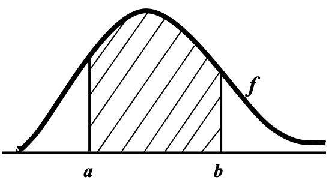

# Ch6: Continuous Random Variables

+ For continous random variables we generally have $P(x) = 0$
+ For continous variables we need another kind of model, where we find probabilities for x being in an interval. this is a **probability density function** or **pdf**

:::info probability density function
non-negative function *f*, such that $P(a \le x \le b) = \int_a^b f(x)dx$
:::

+ In this definition probabilities are areas: the probability that x takes the values between a and b is equal to the area below the graph.
+ Open or Close interval does not affect the probability.

:::tip Properties
+ $f(x) \ge 0$
+ $\int_{-\infty}^{+infty}f(x)dx = 1$

If a function has these two conditions then it is a **pdf**
:::

$$E(X) = \int_{-\infty}^{+\infty} x \cdot f(x)dx$$

$$var(X) = E(X - \mu)^2$$

$$E(g(X)) = \int g(x)f(x) dx$$

## Distribution Function

:::info Distribution Function
The function **F** defined by $F(x) = P(X \le x)$ with $x \in \mathbb{R}$, is the cumulative distribution function cdf of the random variable X
:::

:::tip Properties
For any distribution function:
+ F is non decreasing.
    + if $x_2 > x_1, then F(x_2) \ge F(x_1)$ 
+ $lim_{x\to\infty}F(x) = 1$
+ $lim_{x\to-\infty}F(x) = 0$
+ F is continuous from the right
    + $lim_{h \to 0+}F(x+h) = F(x)$
:::

:::tip Properties
+ $P(a \l X \le b) = F(b) - F(a)$
+ $P(X > x) = 1 - F(x)$
+ $P(X < x) = lim_{h \to 0^+} F(x-h) = F(x)$
+ $P(X = x) = F(x) - P(X < x)$
:::

:::info
A random variable X is continuous if the distribution function F of X is a continous function.
:::

:::tip Properties of Continous distributions
+ $P(X = x) = 0$
+ $P(X \in [a,b]) = \int_a^bf(x)dx = F(b) - F(a)$ closed interval equals open interval
+ $F(x) = \int_{-\infty}^xf(u)du$
+ $f(x) = \frac{d}{dx}F(x)$
+ If the density function f(x) of X is symetric about x = c, then E(X) = c.
:::

## Uniform distribution

