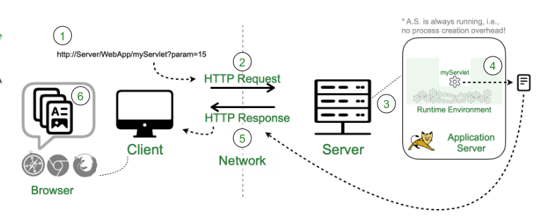
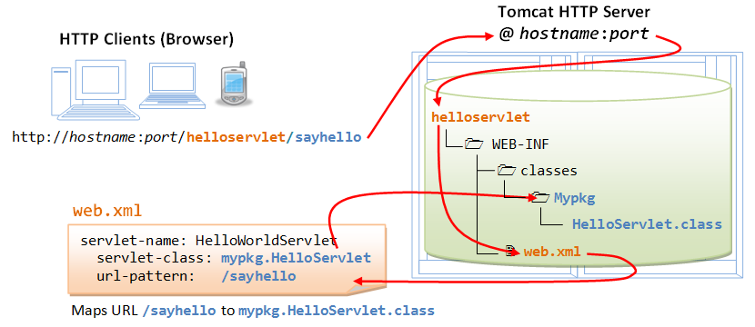

# Lecture 1

## Basic Web Technologies
The *client* is a computer running a *browser*
that can display *webpages*. The *client*
interacts via a network with the *server* which can serve *webpages* and other resources to the *client*.

The client and server rely on *HTTP* (**H**yper**t**ext **T**ransfer **P**rotocol) to send requests and responses.

A *HTTP* request has a method, such as:
+ `GET`
+ `POST`
+ `PUT`
+ `DELETE`

*HTTP* is built on top of *TCP/IP*.

## Server Solutions

### Common Gateway Interface
The Common Gateway Interface (CGI) is a interface specification. It allows programs to be called through the web.
It relates a **program** (with it's parameters) to a **url**

::: tip Example:
`http://example.com/cgi-bin/printenv.pl/somepath?and=a&query=string`

here the parameters are `and=a` and `query=string`.
:::

A typical use for *CGI* is an interface for a database: the HTML page displayed is the result of a query, the query can be changed with the parameters of the url.

The main limitation of *CGI* is poor scalability,
a new *process* is started for each new HTTP request. Meanwhile *servlets* replaces this by creating a new *thread* for each request (which has much lower overhead)

### Java Servlets

::: info Servlet
A java Servlet is a java class that allows you
to build functionality on top of a web server.
Servlets execute in a network server like `Apache Tomcat`.
:::

`HTTP Servlets` allow you to take an incoming http request to the network server and provide a response (*request-response communication model*).

Servlets allow you to generate dynamic content, i.e you can return a custom *response* to the client based on the *request*.

Unlike CGIs, Servlets allow peristent context for applications.

### Servlet Typical Execution Flow



1. Server receives HTTP request sent by user that points to a Servlet.
2. Invokes Servlet by passing the HTTP request to it.
3. Processes request and generates result
    + Http response (HTML page, json document, xml document, etc...)
4. Servlet returns an HTTP response.
5. HTTP Response is sent to the client side.

### Servlet Invocation
Example url:
`http://localhost:8080/bookQuote/bookQuote?isbn=1`

::: tip url format
`[protocol]://[host:port]/webApp/Servlet?Parameters`
:::

+ A single instance of the Servlet is used to handle all requests over the lifetime of the Servlet.

### Servlet Invocation With Web Page
```html
<form action="./bookQuote">
    <p>Enter ISBN number: <input type="text" name="isbn" /></p>
    <input type="submit">
</form>
```

## Servlet Interaction
```plantuml
actor User as User
User -> Browser: request index page
Browser -> Server: HTTP request (index page)
Server -> Browser: HTTP response (index page)
User -> Browser: submit form
Browser -> Server: HTTP request for Servlet
Server -> Book: doGet()
Book --> Server: HTML response page
Server -> Browser: HTTP response
```

### Basic Servlet

```java
import java.io.*;
import javax.servlet.*;
import javax.servlet.http.*;
public class ServletTemplate extends HttpServlet {
    public void doGet(
        HttpServletRequest request
        HttpServletResponse response
        ) throws ServletException, IOException {
        // Use ‘request’ to read incoming HTTP headers
        // (e.g., cookies) and parameters (query data)
        // Use ‘response’ to specify the HTTP response status
        // code and headers (e.g., the content type, cookies)PrintWriterout = response.getWriter();
        // Use ‘out’ to send content to browser
    }
}
```

### Servlet Example

```java
public class BookQuote extends HttpServlet {
    private Quoter quoter;

    public void init() throws ServletException {
        quoter = new Quoter();
    }

    public void doGet(
        HttpServletRequest request
        HttpServletResponse response
    ) throws ServletException, IOException {
        response.setContentType("text/html");
        PrintWriter out = response.getWriter();
        String html = // html
        out.println(html);
    }
}
```
### Development Process Comparison

```plantuml
title Standalone (Java) code
start

while (done?)
  :write code;
  :compile code;
endwhile
:test;

stop

```

```plantuml
title Servlet-based applications
start
fork
    :Write Code;
fork again
    :Create Web Artifacts;
fork again
    :Write Deployment Info;
end fork
:Create Package;
:Deploy Application;
:Test Application;

```

## .WAR File Structure (TOMCAT)
Web applications are packaged in `.WAR` (Web ARchive) files in order to be deployed

WAR files contain the code necessary to run the application:
+ Java bytecode
+ libraries
+ HTML files
+ CSS files
+ pictures etc



Example WAR file structure:
```
/
│   *.html (all html files)
│
└───WEB-INF
    │   web.xml (deployment descriptor)
    │
    └───classes
    │   │   *.class (Java bytecode)
    │
    └───lib
    │   *.jar (libraries)
```

### Deployment Descriptor Example

The *deployment descriptor* allows you to map a Servlet to a URL. The deployment descriptor is the `WEB-INF/web.xml` file an example of a deployment descriptor is:

```xml
<?xmlversion="1.0"encoding="ISO-8859-1"?>
<web-app xmlns:xsi="http://www.w3.org/2001/XMLSchema-instance"xmlns="http://xmlns.jcp.org/xml/ns/javaee"xsi:schemaLocation="http://xmlns.jcp.org/xml/ns/javaeehttp://xmlns.jcp.org/xml/ns/javaee/web-app_3_1.xsd"version="3.1">
<description>BookQuoteServlet</description>
    <display-name>BookQuoteServlet</display-name>
    <servlet>
    <!-- Binds Servlet name to code -->
        <servlet-name>BookQuote</servlet-name>
        <servlet-class>nl.utwente.di.BookQuote</servlet-class>
    </servlet>
    <servlet-mapping>
    <!-- Binds Servlet name to URL -->
        <servlet-name>BookQuote</servlet-name>
        <url-pattern>/bookQuote</url-pattern>
    </servlet-mapping>
</web-app>
```

### Java Annotations
Java annotations are an alternative to the deployment descriptor. They map a servlet class to a url but instead of being in a separate `web.xml file` it is defined in the Servlet that we want to map to a URL.

Example:
```java
@WebServlet(description="BookQuote Servlet", urlPatterns={"/bookQuote"})
public class BookQuote extends HttpServlet {
    ...
}
```

## Javascript
Javascript is a lightweight interpreted programming language. It was created to be a scripting language for web pages.

+ javascript is object-based.
+ javascript has dynamic typing: variable data types are not declared.
+ properties and methods can be added to any object dynamically.

Javascript allows you to change the client page
or parts of the page dynamically.
Therefore pages can become more responsive.

## Web Services

::: info Web Service
A web service is a software system designed to support interoperable machine-to-machine interaction over a network.
:::

A web service is different form a web page.
A web service provides data with no formatting while a webpage is a document that can have a defined formatting.

```plantuml
Client --> Server: GET /books/2
Server -[#3CB371]-> Client: 200 OK
```

### Web Service Flavours

+ SOAP: Web services implemented on top of the SOAP protocol.
    + considered as 'heavyweight'


+ RESTful: Based on the **REST principles**.
    + considered as 'lightweight'

### REST
This is an important topic so it has
it's dedicated [page](./REST) :sparkles:


## Overview

```plantuml
node "Client" {
    [Single HTML Page] - [JavaScript]
}

node "Server" {
    [REST Service] - [Servlets]
}

[JavaScript] - [REST Service]
```