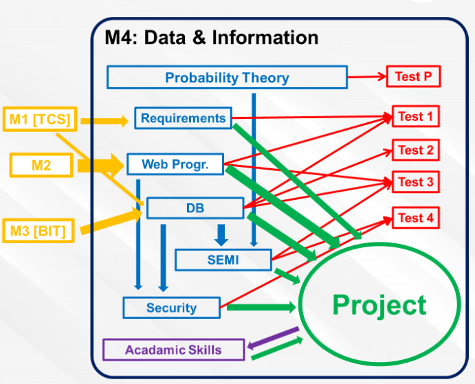

# Module 4: Data and Information

## Goals
The main goal of this module is to develop 
a web application that uses a database. :floppy_disk:

Aside from the project the module offers these subjects that contribute knowledge for the project:
- Requirements
- Databases
- Web Programming
- Semi Structured data
- Security
- Project Skills
- Mathematics

## Project

+ The project starts form week 1.
+ The project is commissioned by a real client.
+ The project will use SCRUM, the most popular agile development approach.

## Grading:

Here we have this *not-confusing* grading scheme. Here is my best attempt at parsing this:

| Assessment | Weight | Min | Date or Deadline | Subjects |
| ---------- | ------ | --- | -------- | ------- |
| Exam 1 | 1 | 5.5 | 7/5 | REQ, WP, DB  |
| Exam 2 | 1 | 5.5 | 21/5 | DB |
| Exam 3 | 1 | 5.5 | 28/5 | WP, DB, SEMI |
| Exam 4 | 1 | 5.5 | 4/6 | SEMI, SEC |
| Probability Exam | 1 | 5.5 | 11/6 | Math |
| Project | 1 | 5.5 | Week 10 | All Subjects |