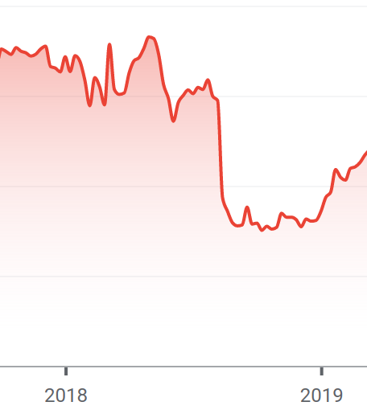

# Lecture 1.

## Value
+ energy $\approx$ value (relationship to physics)
+ fundamental questions:
  + relationship between `value & risk`
  + relationship between `value & information`
  + relationship between `value & psychology`
  + long term vs short term value
  + fair cost allocation.

### News Event Example
Atlantia share price drops when bridge collapses.

### Value Example:
+ my business generates 100k profit per year.
+ what is the value of the company ?

+ investors want to make 10% return per year
  + the `10%` is based on the risk of the business

the value is an infinite series:

$V = 100 000 / 1.10 + 100 000 / 1.10^2 + \dots = \dots$