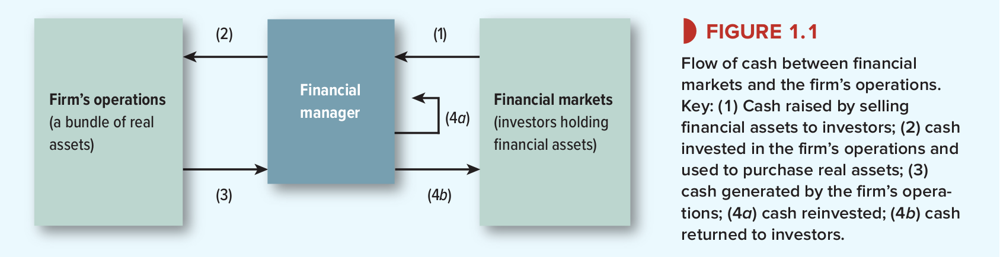

# 1-1 Corporate Investments and Financing Decisions

A company needs a large variety of **real assets**.

Corporations pay for these real assets by:
1. reinvesting cash flow that they generate.
2. selling claims on the assets (**financial assets** or **securities**)

:::tip financial assets example
The bank provides a corporation with money in exchange for a financial asset. The financial asset is that the corporation will have to pay back the loan with interest.

These loans are financial assets, because the bank does **not** trade them on the financial market. When the loan can be traded with in financial markets, it makes them **securities**.
:::

* **investment decisions** include the purchase of real assets
* **financing decisions** include the sale of securities and other financial assets

## 📈 Investment Decisions
Most large corporations prepare an annual **capital budget** listing the major projects approved for investment.

The individual decisions in the budget are called **capital budgeting or capital expenditure (CAPEX)** decisions.

There are two types of investments:
1. **Tangible assets** = assets that you can touch & kick, such as a new oil field or a new factory to produce your product.
2. **Intangible assets** = assets that are not physical, such as research and development, advertising and virtual computer software.

Intangible assets are called **investments** because they build *know-how, brand recognition and reputation* for the long run.

Keep in mind that investments are not always as big as spending billions on advertising, investing is also buying a truck, machine tool to improve work.

Financial managers do not make big investments on their own. They work together as part of a team with lots of business functions.

## 💰 Financing Decisions
For a company to finance something they can raise money from:
1. Lenders -> the corporation borrows money from the lenders and the corporation promises to pay back the debt + a fixed rate of interest.
2. Shareholders -> when shareholders provide the corporation with money they do *not* get a fixed return, they hold shares of stock and therefore get a piece of the future profits.

:::tip Equity financing vs. debt
Shareholders are **equity investors**. They provide the corporation with **equity financing**. The corporation receives money in exchange for shares of stocks. 

Lenders will put the corporation in debt.

The choice between debt and equity financing = **capital structure** decision.
(capital = firm's sources of long-term financing).
:::

There are many choices to be made when it comes to borrowing to finance. Such as: 
* borrow from bank or by tradable bonds?
* borrow for how many years?
* reserve the right to pay off debt early?
* what country to borrow in? ($, €)

Also many choices to be made when financing with equity financing. Such as:
* issue new shares of stock -> investors will pay to receive future profit
* corporation reinvests cash from current assets in buying new assets -> no new shares are put up for sale

Corporations does not reinvest all of the cash flow that is generated:
1. Hold cash for future investments
2. Pay cash back to shareholders (buy back shares)

**payout decision** = decision to payout dividends or repurchase shares

Financial managers need to identify the risks and make sure they are handled correctly. He/she has to outweight the advantages and disadvantages and find the perfect balance. Debt has its advantages, but too much debt can cause the company to go bankrupt. The future of companies and the finance plans can also be altered by changes in interest rates, exchange rates and political developments.

## 🏢 What is a corporation?
:::info corporation
a legal entity that is owned by shareholders, it can make contracts, operate a business, borrow and/or lend money, sue and be sued, pay taxes. A corporation's directors are elected by the shareholders.
:::

corporation is the term used in the USA,
for europe the equivalents are:
+ :tulip: Besloten Venootschap(BV)
+ :fr: Société Anonyme
+ :es: Sociedad Anonima
+ :de: “GmbH” (“Gesellschaft mit beschränkter Haftung”)

:::info articles of incorporation
When a corporation is formed the articles of incorporation are written.
they set out the purpose of the business and how it is to be governed and operated.
:::

A corporation is owned by shareholders, but the corporation is legally distinct from the shareholders. This means that the shareholders can not be held responsible for the corporation's debt.

**Limited liability** = shareholders can not be held personally resposible for the corporation's debts. So shareholders can lose their entire investment in a corporation, but nothing more.

**closely held** = shares of a corporation are privately held by a small group of investors + the shares are not publicly traded

**public companies** = shares of a corporation are publicly traded on for example the New York Stock Exchange.

A large public corporation can have a big amount of shareholders, these shareholders can not control the corporation. There is a *separation of ownership and control* so therefore stockholders can sell all their shares to other investers without disturbing the management/control of the business.

Because corporations are a seperate legal entity in the United States, it is taxed seperately. So corporations pay taxes on their: 1. profits and shareholders pay taxes on their 2. dividends or 3. sell their shares at a profit. Income by businesses is taxed only once as personal income.

Large and medium-sized businesses are almost always corporations.
other types of legal structures for businesses are:
+ sole proprietorship: *(eenmanzaak in nl)* for small businesses and freelancers.
+ partnership: if a group of people want to work together but save the income taxes paid by a corp.
+ LLCs, LLPs (Limited Liability Company) like a partnership but partners have limited liability for debts. 

### 👨‍💼 The Role of the Financial Manager
Role of Financial Manager = trace how money flows from investors to corporation and back to the investors again

