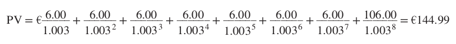
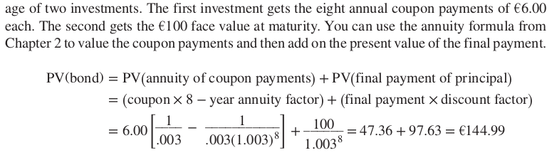
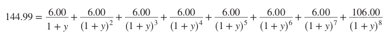

# 3-1 Using the Present Value Formula to Value

**issuer** = the borrower that issues a bond

**bondholder** = the ones that earn for loaning their funds to the issuer

**maturity date** = the time the bond principal must be paid back

**bond principal** = the loaned funds that are borrowed to the issuer by the bondholder

**the coupon** = the interest payment

**the coupon rate** = the interest rate that determines the payment

**face value** = the initial value of the bond

+ €100 face value
+ 6,00% OAT maturing in 8 years
+ coupon = €100 * 0,06 = €6, which you receive each year for 8 years
+ last year you receive the (coupon + face value) = 100 + 6 = €106.

The present value of these payments depends on the opportunity cost of capital. In this situation that means the rate of return offered by other government debt issues. 

Let's say another option is to have a bond with a return of just 0.3%. You will have to divide the cash flows at 0.3%.

So 

$PV(bond) = PV(annuity of coupon payments) + PV(final payment of principal)$
&nbsp;

$= (coupon * 8 - year annuity factor) + (final payment * discount factor)$
&nbsp;

= 

When the price of the OAT is 144,99%, what is the interest rate? We need to find the variable y that solves the following equation: 

**premium** = A bond that is priced above its face value. Yield to maturity on this bond is less than the current yield. So the investors will experience a capital loss.

**discount** = A bond that is priced below its face value. Yield to maturity on this bond is greater than the current yield. So the investors will experience a capital gain.

+ Calculate the yield to maturity by trail and error.
    + Present value greater than the actual price -> discount rate too low.
    + Present value smaller than the actual price -> discount rate too high.

## Bonds in America
**asked price** = the price you need to pay to buy the bond from a dealer
