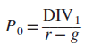
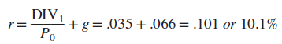
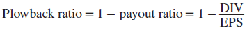
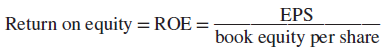
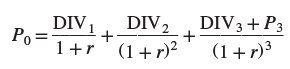
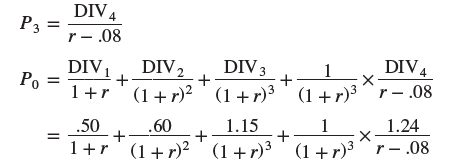

# 4-3 Estimating the cost of Equity Capital

It was discussed in chapter 2 how to caclucate the present value if we are given the discont rate. In this chapter it is discussed whether it gives some insights into stock values. 

If we know the expected dividend grow and a discount rate, we can use the following formula: 

where the variables describe as follows:

g - anticipated growth rate

r - discount rate

DIV1 - expected dividend. 

Example: 
Aqua's stock (WRT) was selling its shares for $33.66 per share at the end of September 2017. Dividend payments for the next year were expected to be $1.18 a share. In the case of Aqua, analysts in 2017 were forecasting an annual growth of dividends by 6.6% 
DIV1 = $1,18
P0 = $33,62

## Calculating the expected return
Imagine we want to calculate the expected return. How can we do it? It is easy, it can be derived from the formula for the Present Value Stock. 

Remember! This formula holds only when g is less than r!!!

Great! Evrything looks fine but you may ask yourself a question where we will take this values from since it is supposed to happen in one year. We cannot predict the future right? 
One option is to concult the views of security analysts who study the prospects the company. These estimates may provide an indication of the expected long-run growth path. 

## Estimating the long-run growth
An alternative approach to estimating long-run growth starts with the payout ratio, the ratio of dividends to earnings per share (EPS).

## Return on Equity
Another important formula is Return on Equity (ROE). It the company's ratio of earning per share to book equity. 

The last part of this chapter describes Disccounted Cash Flow with Two or More Stages of Growth. Let's talk about it on the example so we can get good understanding. 

## Example with using DCF formula
Consider Growth-Tech Inc with DIV1 = $50 and P0 - $50. he firm has plowed back 80% of earnings and has had a return on equity (ROE) of 25%. It has the growth rate equal to 20%. For the sake of simplicity lets assume that for the first 2 years the return on equity stays the same and then suddenly it drops in the 3rd year to 16%. Then the firm respondds  by plowing back only 50% of earnings. As a consequence dividend growth rate drops to 8% (plowback ratio X ROE). 
So let's take a deeper look. 
Growth-Tech starts year 1 with book equity of $10.00 per share. It earns $2.50, pays out 50 cents as dividends, and plows back $2. Thus, it starts year 2 with book equity of $10 + 2 = $12. After another year at the same ROE and payout, it starts year 3 with equity of $14.40. However, ROE drops to .16, and the firm earns only $2.30. Dividends go up to $1.15 because the payout ratio increases, but the firm has only $1.15 to plow back. 

Therefore, subsequent growth in earnings and dividends drops to 8%.
    Now we can use the general DCF formula. 
    

    
But one moment, where will we take P3 from?  We can use the constant-growth formula to calculate it. After we have it, we can continue with the rest of the calculations. 

