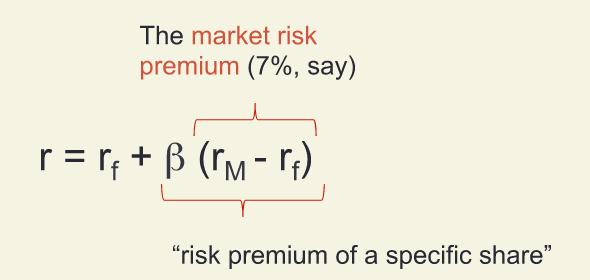
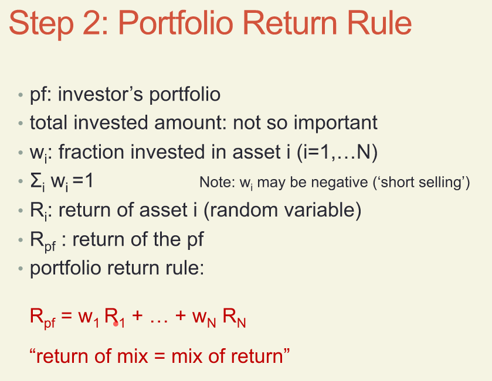
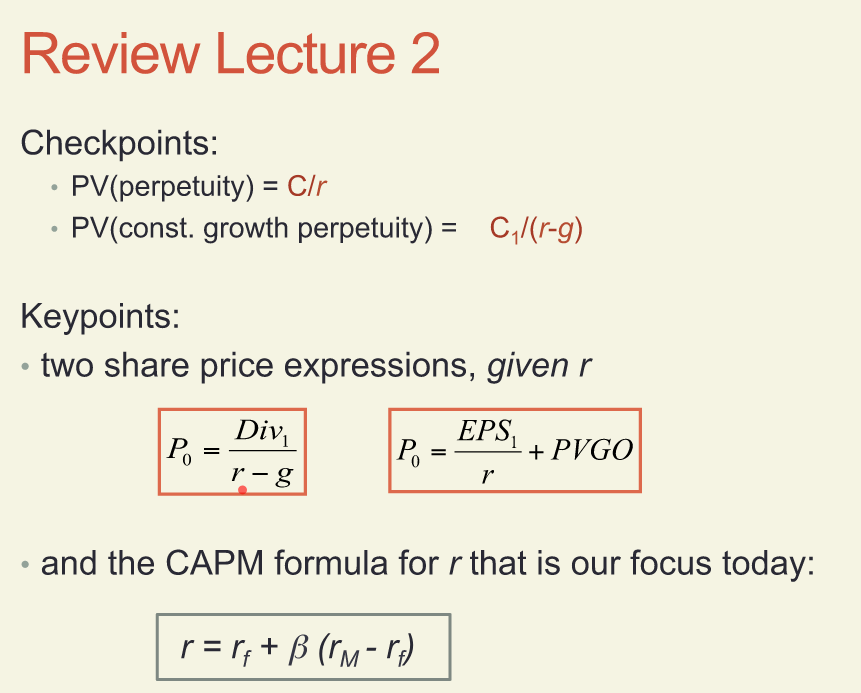

## Key point 3: CAPM (Capital Asset Pricing Model)
beta = company dependent scalor, 

intuitively = beta measures the scale of risk in an asset

**market risk premium** = the percentage you would earn more by investing in the current market then by investing in Treasury Bonds

## How to Evaluate Beta
### Step 1: From price levels P to return R
+ Investor consider to buy a share X
+ Assume a one-year investment horizon
    + today: t=0  pay price P0
    + next year t=1
+ P1  share price next year as _random variable_
+ DIV1 dividend next year as _random variable_
+ R (or Rx) return over next year as _random variable_

$R = (P1 + DIV1 - P0) / P0

### Step 2: 

+ pf: investor's portfolio
+ total invested amount: not so important
+ Wi: fraction invested in asset i (i=1,..N)

Have to look at certain points from lecture 2, missed it while sleeping.

