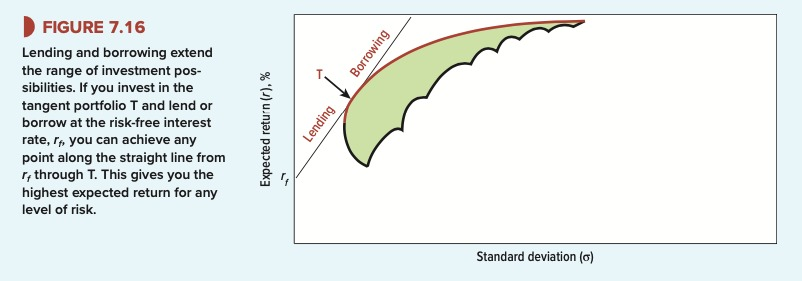
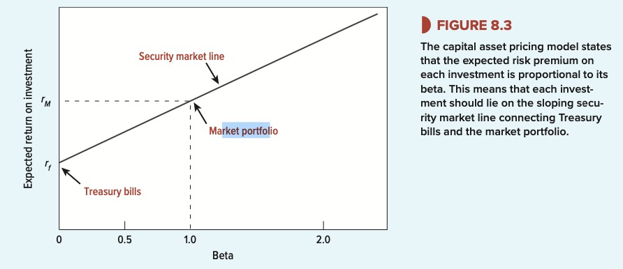
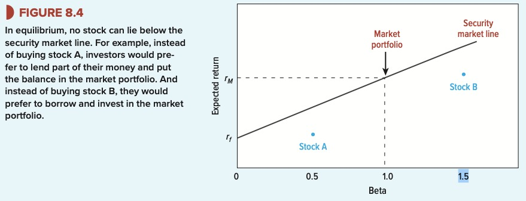

# Finance Entire Course Summary

## Chapter 1

Two decisions companies can make:

- Financing Decision
- Investment Decision

Payout Decision: Pay dividends or repurchase shares (to increase the price of the shares by reducing offer)

::: info **Market Capitalization**
the value of a company that is traded on the stock market.

$MarketCap = Price \cdot numberOfShares$
:::

⇒ value comes mainly from the asset side of the company

⇒ financing decision alone cannot cause success but can cause fail.

**capital structure**: decision of loan vs equity.

Each shareholder wants three things:

1. to be as rich as possible
2. to manage timing of his consumption plan by decinding whether to consume his wealth now or invest it to spend later.
3. to manage the risk charcteristics of the consumption plan.

::: info **Fisher separation theorem**

Financial managers and shareholders may have different goals, this means financial managers have to maximize the company’s value (all the time) while shareholder want to get as rich as possible either through dividends or selling the stock (at different times that suit them)
:::

**Externalities**: when companies benefit society but do not feed back their profits.

- if investments give higher rate of return that when shareholders invest on their own in financial markets, then the shareholders are happy about the investment.
- Opportunity cost depends on external factors only, not internal factors (like interest on loans)
    - possible projects within the company don’t determine the opportunity cost. project A ⇒ 15% rate of return; project B ⇒ 16% rate of return. Both projects should be done if the opportunity cost is 10%

## Chapter 2

::: tip **Present Value Formula**

$$
PV = \frac{FV}{(r+1)^n}
$$

- **FV**: payoff
- **r**: discount rate (available on the market)
- **n**: number of years until you obtain FV
:::

Suppose you want to start a University. You expect that it will payoff 1.000.000 euros in 5 years.

Given that the market rate is 12%. We can calculate the PV = 567 426.

⇒ this is the amount of money you need to invest in the stock market to get 1 000 000 euros after 5 years.

⇒ it is also the amount of money that the 1 000 000 is worth at this time.

⇒ up to this amount of money 567 426, it is reasonable to spend in the school to make 1 000 000

::: tip **Net Present Value**

$$
NPV = PV -initialInvestment
$$

- **initial investment**: how much you invest today in the project to make the payoff in the future.
- **PV:** the present value.
:::

The initial investment is how much you actually invested today into the project to make the 1 000 000 in the future.

→ this is simply a prediction by adding up all the costs for the investment. Example founding a university. The following costs are needed: `pens + papers + etc…`

#### Simple Interest Rate

$$
FV = 100\cdot 1.12 + 100 \cdot 1.12 + \dots
$$

#### Compound Interest Rate

$$
FV = 100\cdot1.12+ 112\cdot 1.12 + \dots
$$

$$
FV = initalInvestment \cdot r^n
$$

- **initial Investment**: how much money do you put in in the beginning.
- **r**: the compound interest rate
- **n**: number of years invested

#### Risk & Present Value

- Uncertain Cash Flows ⇒ calculations of NPV are wrong.
- Certain Cash Flows ⇒ e.g buying govmt securities

In risky Investments ⇒ uncertain cash flow.

- we call the future value the expected value, and we get the expected cash when discounting.
- r is the rate of return (you need to pick an r of an investment with similar risk.)

#### Rates of Return & Present Value

$$
Return_{of\, project} = \frac{profit}{investment} = \frac{FV-investment}{investment}
$$

- **Investment Rule:** accept investments having higher rate of return than the opprtunity cost.
- **net present value rule:** accept investments having positive net present value.

#### Calculate Present Value with Multiple Cash Flows

$$
PV = \frac{C_1}{(1+r)^1} + \dots + \frac{C_n}{(1+r)^n}
$$

**Example:**

year 1: you rent a building

year 2: you rent the building (for a higher price)

year 3: you sell the building

#### Perpetuity

::: info 
**Perpetuity**
a perpetuity is an investment that pays the same cashflow every year, in perpetuity from year 1.

:::

$$
PV = \frac{C}{r}
$$

- Perpetuity Due: is when the perpetuity starts in year 0 (you need to pay it yourself)

$$
PV = Cashflow(T_0)+\frac{C}{r}
$$

- Delayed Perpetuity: when the perpetuity starts in year n instead of year 1.

$$
PV = \frac{C}{r}\cdot\frac{1}{(1+r)^n}
$$

#### Annuities

::: info Annuity
Annuity is when you get a fixed payment each year for a defined amount of years.
:::

To calculate an annuity you take the full perpetuity and you remove the delayed perpetuity to cancel out the payments that cease to happen in the annuity.

$$
Annuity = Perpetuity - DelayedPerpetuity
$$

$$
Annuity = \frac{C}{r}-\frac{\frac{C}{r}}{(1+r)^n}
$$

**Annuity Factor**

Is the factor which you can multiply the fixed payment of the annuity to get it’s present value.

- **t** is the parameter that means how many years the annuity lasts.

$$
AnnuityFactor(t) = \frac{1}{r}-\frac{1}{r(1+r)^t}
$$

**Annuity Due**

$$
AnnuityDue = Annuity \cdot (1+r)
$$

**Amortizing Loans**

Loans with fixed payments required. Therefore it is an annuity.

If you want to find the amount of each payment solve for C.

**Future Value of Annuity**

If you have the present value of annuity you can calculate the compound interest you get on this annuity by multiplying it by the interest rate to the power of the amount of years you are saving.

$$
FV = PresentValue_{Annuity} \cdot (1+r)^n
$$

**Growing Perpetuities**

Constant growth DCF model, only used if g < r → g must approach r to be perpetual.

$$
PV_{growing\,perpetuity} = \frac{C_1}{r-g}
$$

**Growing Annuities**

$$
PV_{growing \, annuity} = C \cdot \frac{1}{r-g} [1-\frac{(1+g)^t}{(1+r)^t}]
$$

**Growing Annuity Due**

$$
PV_{annuity \, due} = PV_{growing \, annuity} \cdot (1+r)
$$

**How is interest Paid and Quoted**

- **APR:** annual percentage rate.
    - tells how much interest is paid over the course of the year but not how often it is paid.
- **EAR:** effective annualrate.
    - takes into account how often the APR is paid.

$$
EAR = (1 + r)^{payments}-1
$$

**Continuous Compounding**

→ no limit on how frequently interest could be paid.

→ payments spread evenly and continously over the year

→ interest can be continously compounded

from continously compounded ⇒ annually compounded: $e^{rt}$ 

from annually compounded ⇒ continously compounded: $ln(1+r)$

**Example**

- Investing $1 at a continously compounded interest rate is: $e^{rt}$
- Present value of $1 at end of year t is $\frac{1}{e^{rt}}$

compounding interest rate = $e^{rt} - 1 = e^{0.11\cdot1}-1=0.1163$

interest rate is 11.63

Inflation Real Interset Rate

$$
1+real = \frac{1+nominal}{1+i}
$$

## Chapter 3

#### Bonds

- If cash is needed short term → take loan
- If cash is needed long term → issue/create bond

Interest rate of government bonds is benchmark.

- when government bonds go up and down → corporate rates follow proportionally

when interest rates **fall** → bond prices **rise**

- prices of long term bonds more sensitive than short term changes interest rates.

volatility = how fast something changes

duration of a bond is related to the bonds volatility.

::: info **Bonds**
When you own bonds you get a fixed set of cash payoffs and in the end of the maturity you get the debt back.

 :::

- bondholder ⇒ get’s coupons : provided initial finance for company/government
- bond issuer ⇒ pays coupons : got financing from bondholders

$$
PV(bond)=PV(annuity \, coupon) + PV(final \, payment)
$$

- yield to maturity = market rate (the max rate of return you can get from another bond)
    - The lower the yield to maturity the higher the price of the bond.

**Names of bonds:**

- **discount bond**: bond is priced below face value. capital gain
- **sold at par**: ytm did not change (market does not fluctuate) the bond is sold at the face value.
- **premium bond:** bond is priced above face value. capital loss

YTM is used to calculate the current price of the bond.

Coupon Rate = YTM at time 0

But then the market fluctuates after time 0 and yield to maturity (interest rate on the market) can change but coupon rate for the bond keeps beign constant just as the same rate for which you sold the bond.

⇒ only general procedure for calculating YTM is trial and error. You guess at a figure and calculate the PV of the bond’s payment and try out discount rates.

Nominal Interest Rate ≠ real interest rate

- less than 10 year bonds ⇒ notes
- you can buy bonds from bond dealers
- treasury bills → matures in one year or less.
    - semi annual coupons

$$
Rate\, of \,Return = \frac{coupon\, income+price\, change}{investment}
$$

Modified Duration: How price of bond will be affected if interest rate changes.

Bond duration affected by:

- yield to maturity
- maturity
- coupon rate

if coupon and yield are the same, duration increases with time left to maturity

→ relation of interest rates are the term structure.

spot rate: interest rate that is fixed today on a loan that is made today

**fisher’s theory**

a change in the expected inflation rate causes the same proportional change in the nominal interest rate, it has no effect no effect on the required real interest rate.

 

#### Spot rates

Law of one price

→ in a competitive market identical assets need to be sold for the same price

Interest rate risk

long duration bonds are more volatile than short duration bonds

5%

10%

Corporate Bonds

⇒ higher risk higher yield

junk bonds

risk of default + severity = credit risk

## Chapter 4

book value of asset = the cost of the asset

net book value (of an asset) = cost of asset - depreciation

accounts payable

accounts receivable

**book value of equity = what you have - what you owe**

book value of equity = (plant + machinery + …) - (total liabilities: outstanding bonds, bonds loans …)

Equity shareholders = Common shareholders + preferred shareholders

shareholder equity = company’s net worth ⇒ how much is paid to shareholders if everything is sold.

$$
BVPS =\frac{stockholder equity - preffered stock}{average shares outstanding}
$$

Book value per share is used to determine if a company’s stock is undervalued if all assets were sold, dividends paid and all other liabilities → what is the value of the share.

Price-To-Book Ratio:

$$
P/B =\frac{stock pricepershare}{book value per share}
$$

→ stock is x times the book value.

EV: enterprise value = total value of a company → market cap + debt 

Two approaches for valuing stocks:

1. valuation by comparables
    1. identify comparables
    2. how much investors in comparables pay per dollar of earnings /book value
    3. what would business be worth if traded at comparables price earnings (P/E=P/ESP) or (P/B)
    4. imagine you are an investor and need to compare companies A and B stocks
2. forecast and discount business dividends or future cash flows

Expected Return = 

$$
r=\frac{Div_1+P1-P0}{P0}
$$

Price

$$
P0=\frac{DIV1+P1}{1+r}
$$

Future value of stocks P1

$$
P1=\frac{DIV2+P2}{1+r}
$$

$$
P0 = \frac{DIV1}{r-g}
$$

## Chapter 5

- NPV is the difference between project value and cost.
- companies should take positive NPV projects and reject negative NPV projects.

::: info 
🏄🏼‍♂️ **NPV Process
1. Estimate Cashflow of project
2. Find the appropriate r (discount rate)
2. Discount the cashflow using r
3. Calculate NPV by substracting the investment**

 :::

**Alternative Investment Criterion to NPV:**

- IRR
- payback
- book rate of return
- profitability index

**Advantages of NPV:**

- The NPV offers clear benchmark: positive NPV = accept, negative NPV = reject
- NPV depends on all the forecast cashflows from the project
- NPV recognizes: *dollar today worth more than dollar tommorow*
- NPV depends only on the forecast cashflows of a project
- You can add up NPV: NPV(A+B) = NPV(A) + NPV(B)

#### Payback Rule

We spend 300 a year, at the laundromat, If we bought a washing machine for 800 it would pay for itself within three years. ⇒ payback rule.

::: info 
⏳ **Payback Period**
A project’s payback period is found by countring the number of years it takes before the cumulative cash flow equals the inital investment.

 :::

**Payout Rule states that a project should be accepted if it is less than some specified cutoff period.**

Can give misleading answers because:

- ignores cash flows after the cutoff date
- the payback rule gives equal weight to all cash flows
- the choice if a cutoff period is arbitrary

#### Accounting Rate of Return

Net present value depends only on the project’s cash flow and the opportunity cost of capital.

But when companies report to shareholders, they show cashflows and accounting profit and assets. That is the profits and assets that are carried on the firm’s books.

$AccountingRateofReturn = \frac{average\, profits}{average\, assets}$

Is unreliable because:

- accounting return ignores the time value of money
- there is no clear benchmark (managers sometimes compare the profitability to the company’s profitability as a whole)

#### Internal rate of Return Rule

Alternative NPV formula as rate of return:

$$
NPV = r_i - r_m
$$

- where $r_i$  is return of the project
- $r_m$ is the opportunity cost

**if $r_i$ equals $r_m$ then NPV = 0**

::: info 
♻️ **Internal Rate of Return**
The discount rate that gives a zero NPV for a given project.

 :::

**Calculating IRR**

Equation to be solved:

$$
NPV=C_0+\sum_{t=1}^{t=T}\frac{C_t}{(1+IRR)^t} = 0
$$

The process of calculating IRR involves trial and error.

for a project with cashflows: C0: -4000 ⇒ C1: +2000 ⇒ C2: +4000

$$
NPV=-4000+\frac{2000}{1+IRR}+\frac{4000}{(1+IRR)^2}=0
$$

IRR = 0 ⇒ +$2000

IRR = 0.5 ⇒ -$559

correct: IRR = 0.2808 ⇒ $0

::: info 
📐 **Internal Rate of Return Rule**
if IRR is greater than Opportunity Cost the project has a positive NPV,
if IRR is equal to opportunity cost the project has an NPV of 0
if IRR is lower than the Opportunity Cost the project has a negative NPV

**Take projects with IRR greater than Opportunity Cost**

 :::

this is helpful because sometimes we don’t know the cost of capital exactly but we can know roughly if it’s greater or lower than the IRR. for example we know that the opportunity cost is less than 28% but we don’t know exactly if it is 12% or 13% so we cannot calculate NPV like normally.

#### IRR Pitfalls

**Lending or Borrowing**

| Project | c0 | c1 | IRR | NPV at 10% |
| --- | --- | --- | --- | --- |
| A | -1000 | +1500 | 50% | +365 |
| B | +1000 | -1500 | 50% | -364 |

Project A is lending ⇒ high IRR is good.

Project B is borrowing ⇒ high IRR is bad.

- IRR does not work when NPVs don’t decline as discount rate increases
    - basically this means that you have negative return on a project.

**Solution ⇒ use NPV**

**Multiple Rates of Return**

**Projects can have two or more rates of return.**

⇒ Two Discount rates make NPV = 0

Two discount rates make NPV = 0

It is not clear what IRR we should compare to the opportunity cost of capital.

As the discount rate increases IRR first rises and then falls (because a change from positive cashflow to negative cashflow)

**Solution ⇒ use NPV**

**Mutually Exclusive Projects**

Firms often have to choose an alternative way of doing the same job or using the same facility.

⇒ if you do project A you cannot do B

| Project | C0 | C1 | IRR | NPV at 10% |
| --- | --- | --- | --- | --- |
| D | -10000 | +20000 | 100 | +8182 |
| E | -20000 | 35000 | 75 | +11818 |

IRR does not take into account the project’s scale.

**solution ⇒ use incremental flows**

🔴  you need to take the greater cashflow - lower cashflow project

Cashflow 0 of E - Cashflow 0 of D = -20000  - (-10000) = -10000

Cashflow 1 of E - Cashflow 1 of D = 35000 - 20000 = 15000

recalculate IRR = 50%

IRR is greater than the opportunity cost of capital so you should take project E.

**More than one Opportunity cost of capital**

We assumed that the opportunity cost of capital is the same for C1, C2 …

but there can be different costs of capital for each cash flow.

#### Choosing Capital Investments with limited resources

- companies do not have unlimited money
- we need to choose projects that provide the best bang for your buck
- the projects that offer the highest net present value per dollar of investment.

$$
ProfitabilityIndex = \frac{NPV}{investment}
$$

| Project | Investment | NPV | Profitability Index |
| --- | --- | --- | --- |
| A | 8 | 18 | 2.3 |
| B | 5 | 16 | 3.2 |
| C | 5 | 12 | 2.4 |
- All projects are attractive because they have postive NPV
- if you are limited to 10 budget
    - choose BC and reject A: because together higher NPV and profitability index.
- if you have only 9 budget
    - choose A because higest NPV

**capital rationing in practice**

- soft rationing
    - no shortcoming in the financial markets
    - limit adopted by managers to control expenditures
    - used to deal with biased forecasts from sub-managers
    - NPV can still be used to choose projects.
- hard rationing
    - projects with significant NPV’s are passed up ⇒ firm should raise more money
    - if the company cannot raise capital then it has hard rationing.
    - NPV can still be used

## Chapter 7

::: info **Treasury Bills**
U.S government debt securities maturing in less than one year.

 :::

**Levels of Risk:**

1. Treasury Bills (lowest)
2. Treasury Bonds (middle)
3. Stocks (high ☠️)

::: info **Risk Premium**
Higher rate of return you can expect to make from riskier assets such as stocks instead of risk free assets.

 :::

::: info **Risk Free Interest Rate**
$r_f$
Interest an investor would expect from an abolutely risk-free investment over a specified period of time.

 :::

::: info **S&P 500**
List of top 500 stock market companies.

 :::

The interest rate of goverment bonds (Treasury Bills - short term) is the risk free rate. A government never stops working, if you have a debt as a government you will not fail to pay it most likely, that’s why it is assigned as risk free.

### Predicting Opportunity Cost

**Method 1**

1. calculate the average return of stock market (add up all returns of S&P 500 and average).

**Method 2**

1. look at current return of treasury bills `(rf = 2%)`
2. calculate average risk premium of stock market on historical data. $normalRiskPremium = avg(stockMarket) - avg(treasuryBills)$
3. We get `rs` which is the return on stock market which is the opportunity cost predicted. $r_s = r_f + normal RiskPremium$

**How to measure risk.**

- discount rate for safe project = risk free interest rate.
- rate of projects as risky as market = expected future return on market.

#### Variance and Standard Deviation

Normal Distribution. (of returns)

$$
N \sim (\mu, \sigma^2)
$$

standard deviation = risk

mu = expected = how high is the average return.

$$
\sigma = \frac{(actual - expected)^2}{n-1}
$$

Population:

$$
std_{pop} = \frac{\sqrt{\sigma}}{n}
$$

Sample:

$$
std_{sample} = \frac{\sqrt{\sigma}}{n-1}
$$

mu = (1 + 2 + 3 + 4 + 5 +6) / 6 = 3.5

sigma = (1 - 3.5)^2 + (2-3.5)^2 + (3-3.5)^2 + (4-3.5)^2 + (5-3.5)^2 + (6-3.5)^2 / 6 = 1.71

#### How diversification reduces risk

We can calculate our measures of risk well for individual securities. Every stock is more risky than it’s domestic market index.

::: info **Market Portfolio**

The market portfolio is made out of individual stocks, average risk of market portfolio does not reflect the risk of individual stocks together.

The market portfolio is made out of all stocks in the economy where the weights correspond to the fraction of the overall market. For example if Apple comprises `3%` of the value of all traded stocks in the US then Apple will be `3%` of the market portfolio.

:::

[S&P 500 Map](https://finviz.com/map.ashx?t=sec)

The standard deviation of your portfolio will generally not be a weighted average of standard deviations of individual securities → diversification reduces risk.

- two standard deviations define the risk of each stock in isolation $\sigma_1, \sigma_2$
- covariance between stock 1 and 2 is the risk of stock 1 and 2.
- x is the investment

$$
PortfolioRisk = x^2_1\sigma_1^2 + x_1x_2\sigma_{1,2} + x_1x_2\sigma_{1,2}+x^2_2\sigma^2_2
$$

Correlation:

- positive correlation coefficient max +1, if A goes up B goes up proportionally.
- negative correlation coefficient max -1, if A goes up B goes down proportionally.
- correlation 0, returns on stock are fully unrelated.

**Portfolio Risk if correlation = +1**

$$
PortfolioRisk = x^2_1\sigma_1^2 + x^2_2\sigma^2_2
$$

::: info Risk / Diversifiable Risk**

Specific risk affects only one company or companies in a single industry. Example: A pilot strike would hurt Southwest but not Amazon → Investors solve this risk by diversifying into unrelated companies.

 :::

::: info **Systematic Risk**
Risks shared by almost all businesses. Example: collapse in economy → you cannot diversify it away.

 :::

$$
Total Risk = SpecificRisk +SystematicRisk
$$

#### Limits of diversification:

When there are just two securities → equal number of variance and covariance.

Many securities → number of covariance becomes larger than variance.

Well diversified portfolios reflects mainly covariances.

$$
PortfolioVariance = \frac{1}{N} \cdot AverageVariance + (1-\frac{1}{N})\cdot AverageCovariance 
$$

- After about 20 or 30 companies you have maxed out the benefits of diversification.

#### Systematic Risk Is Market Risk

Investors do not have to compute market risk since all investors are given the same market info. Market Portfolio → its volatility and returns are known. Investors do not hold individual stocks → they hold portfolios.

⇒ systematic risk shared with rest of portfolio.

Curved blue line shows combinations of expected return that could achieve by differerent pairings of two stocks called the “investment opportunity set”

- the red dotted line: -1 negative correlation
- golden line: +1 correlation → no gain from diversification

Calculate standard deviation (total risk) and get amount of return.

Each dot marks combination and risk of return.

#### Calculating the efficient market frontier: Markowitz

::: info **Efficient Portfolios**

Efficient portfolios are portfolios that have: High expected return, low standard deviation.

 :::

- Red curve = efficient frontier → narrow efficient choice of all combinations.

::: info **Fisher Separation Theorem**
Separate investment decision from shareholder preferences. If Investors use borrowing and lending to satisfy their individual preferences, they’ll agree on how to measure systematic risk.

 :::

#### Portfolio Choice Borrowing and Lending

To Decrease your Risk but decrease return:

- **lend** money by buying bonds (treasury bills) you will receive the risk-free rate.
- Invest the rest in a risky asset (stock)

To Increase your Risk and increase return:

- **borrow** money from a lender.
- Invest initial money + borrowed money into the stock.

$$
Sharpe\, ratio = \frac{RiskPremiun}{std} = \frac{r -r_f}{\sigma}
$$

The slope of the line between the risk free rate and a portfolio is known as the sharpe ratio.

- you want a steep line
- you want highest sharpe ratio.

the **lending borrowing line** opens up new portfolio choices.

You can draw a line that passes through portfolio straight line between the risk free rate and any portfolio on the efficient frontier of stocks.

The last steepest possible line is the tangent which touches the *tangency portfolio* **T**

The tangency portfolio is the one everyone will want to take, but on the tangent of T every investor chooses it’s preference of risk and return.

### Measuring Investment Manager Performance

- The sharpe ratio is a way to measurre the risk adjusted returns which is a more accurate measure of skill rather than the raw return.

- The straight line through T is called the **Capital Market Line**

::: info **Two Fund Separation Theorem**

investor job:

1. select best portfolio T: with the highest sharpe ratio.
2. combine with **borrowing** / **lending**

Each investor holds just two investments: **(T, Borrow || Lend)**

 :::

Capital Market Line Equation
⇒ how to calculate your return based on portfolio risk.

$$
= r_f + sharpeRatio \cdot \sigma_p
$$

#### Company Diversification

- Companies don’t need to diversify.
- Investors should diversify on their own.

**Value additivity Property**

When evaluating a project, a company can value it in isolation. A project will only add the present value of itself to the company. The manager does not need to consider how the project meshes with the other projects of the company. This property extends to any number of projects.

$$
PV(AB)=PV(A)+PV(B)
$$

The bottom line is this: It does not matter how many existing businesses a company has, or what these businesses are. The value of a new project depends on it’s own discounted cashflows.

---

## Chapter 8

::: info 
**Beta**
(market sensitivity)
How much a stock price changes when the stock market goes up or down (by 1%).

 :::

**Formula Beta of a stock called i**

---

- $\sigma_{im}$: covariance of stock and market
- $\sigma^2_m$: market variance

$$
\beta = \frac{\sigma_{im}}{\sigma^2_m} = p_{im}\frac{\sigma_i}{\sigma_m}
$$

---

- Average beta of all stocks is 1.0
- 

**Market Risk**

$$
Total Risk = Specific Risk + Market Risk\\
MarketRisk = \beta_i\sigma_M
$$

$$
r_i = \alpha + \beta_ir_m+\epsilon_i
$$

Best estimate of Bi - the regression coefficient that captures the average effect of the market return on Amazon’s return - is the covariance divided by the variance. This is the formula for beta.

R-squared is the goodness of fit. → how close the returns are to the line.

$$
R^2=\frac{\sigma^2_{im}}{\sigma_i\sigma_m}
$$

$$
R^2=\rho_{im}^2
$$

If a stock has high standard deviation and low beta → it is diversifiable.

**Sealink’s Beta Example**

→ std market: 20%

→ std sealink: 30%

→ covariance: 0.03

$\beta = \frac{0.03}{0.2^2}$

#### Market Portfolio

In practice too difficult to take the real market as a comparison.

→ we use approximations:

- S&P 500

#### Why Betas Determine Portfolio Risk

- The risk of a well diversified portfolio is given by it’s market risk.
- The market risk of a stock is measured by it’s beta.
- The beta of a portfolio is the weighted average of betas of the individual stocks withing that portfolio.

The risk of a well diversified portfolio is:

$$
\sigma_{portfolio} = \beta_{portfolio}\cdot\sigma_M
$$

### The relationship between risk and return

**Return, as the risk free + risk premium (only for the market portfolio)**

$$
r_p = r_f+\frac{r-r_f}{\sigma_M}\sigma_p
$$

**For an individual stock**

$$
r_i =r_f+\frac{r_M-r_f}{\sigma_M}(market\, risk\, of \, stock \,i)
$$

$$
r_i = r_f + \beta_i(r_M-r_f)
$$

**Risk Premium: CAPM**

$$
r_i -r_f = \beta_i(r_M-r_f)
$$

Security Market Line → beta with the respective returns.

- security market line
    - x axis ⇒ beta
    - applies to all stocks and portfolios
    - since beta is undiversifiable every increment must be rewarded ⇒ no stocks lie above or below the line.
- capital market line
    - x axis ⇒ risk
    - efficient portfolios
    - stocks can lie below the line
    

an efficient portfolio is comprised of individually inefficient assets.

### Logic Behind CAPM

1. Investors like high return and low risk
    1. Portfolios that offer the highest expected return for a given level of risk are called **efficeint portfolios**
2. if investors can lend and borrow at the risk-free rate of interest, one efficient portfolio is better than all others: the portfolio that offers the highest ratio of risk premium to standard deviation (portfolio T). A risk averse investor will put part of his money in this efficient portfolio and part in the risk free asset. A risk tolerant investor will put part of his money may put all his money in the portfolio or borrow and put even more money in.
3. Since everyone holds the same portfolio of stocks it must be the market portfolio. Only market risk is relevant
4. Investors don’t hold any individual stocks, they prefer portfolios. So what matters isn’t the total risk of a stock because part of this risk is specific to that stock and diversified away when held as part of the portfolio. What is left is the systematic risk that is shared with the rest of the investor’s portfolio.
5. Since all investors hold the market portfolio, systematic risk is market risk, the sensitivity of a stock changes the market. This sensitivity is known as beta.

### Beta

|  | good times | bad times |
| --- | --- | --- |
| high beta | excellent returns | terrible returns |
| low beta | ok returns | ok returns |

low beta → can save you

high beta → can make you rich

**Negative Returns:**

people will invest in expensive investments that save them in bad conditions

- insurance (house burns down)
- stocks with very negative beta

#### Applying CAPM

In the real world CAPM theory expects: 

- more risk more return: true
- security’s expected return should only depend on it’s beta: true specific risk lower is not rewarded by investors because they can diversify by themselves.
- predicts the increase of 1% to 1 beta: debated.

In the real world CAPM assumptions:

- investors can lend & borrow at the risk free rate:
    - some investors cannot **borrow** at the risk free rate! ⇒ more demand for high beta stocks. ⇒ higher price for high beta stocks ⇒ lower return for high beta stocks.

Trading strategy: buy low beta stocks + sell high beta stocks + borrow at risk free rate if possible and invest the money in the low beta stocks.

Other characteristics also predict returns, Historically:

- small cap outperform big cap
- high book value-to-market cap outperform low book-to-market

### Alternative Theories

#### Arbitrage Pricing Theory

It assumes that each stock’s risk premium comes from economic “factors”. Factors can be for example:

- oil price
- interest factor

some companies are more sensitive to a specific factor, exxonMobil is more sensitive to the oil price than coca cola is sensitive to the oil price.

$$
Return = a+b_1(r_{factor 1})+b_2(r_{factor2})+\dots+noise
$$

- noise: stands for specific, diversifiable risk
- b1, b2: the weights (how much a factor affects the company)

APT Agrees with CAPM that there are two sources of risk: market and specific risk. specific risk can be diversified therefore $ExpectedRiskPremium = r-r_f = b_1(r{factor1}-r_f)+b_2(r_{factor2} -r_f) + \dots$

Expected Risk Premium Formula gives the conclusions:

1. If all the b’s in the formula are 0 ⇒ expected risk premium is 0
    1. a portfolio that is well diversified noise eliminated: (~~noise~~)⇒ and has zero for all b’s (0 sensitivity to factors) ⇒ it must give the risk free rate (as return) (e.g 2%). ⇒ if it gives **more**, you can make a risk free profit (**arbitrage**) by borrowing money to buy the portfolio ⇒ if it gives **less** you can make a risk free profit by selliing the portfolio and invest the proceeds in at the risk free rate of interest.
2. The risk premium of a diversified portfolio will vary in direct proportion to it’s sensitivity to each factor.

Example:

Portfolio A = 0.6 * factor 1

Portfolio B = 0.3 * factor 1

A has double sensitivity so A has to offer double risk premium.

Suppose Risk Premium of A = 7% and B = 3%

An owner of B can make risk free profit by selling B and investing the proceeds into 50-50 Portfolio A and Treasury Bills.

The risk of the new portfolio is still 50%*0 + 50% *0.6 = 0.3 but the risk premium is:

50%* 0 +50%*7% = 3.5%

#### The three Factor Model

It is a simplification of the arbitrage pricing the arbitrage pricing theory.

The three factor model says that there are three factors:

- market factor
    - how does the market do (beta in CAPM)
    - market returm is measured with the return of a market index such as S&P500
    - comes from the same idea as beta (porche does better when the market goes up because everyone has money ⇒ there is a relationship with the return of a company and the market)
- size factor
    - how big is the company
    - size is measured with market cap
    - comes from the fact the historically small stocks do better than large market cap stocks.
- book to market factor
    - is the company more like a startup (Low book value) or more like an enterprise (high market value)
    - book to market is measured with book to market ratio ($\frac{book value}{marketcap}$)
    - comes from the fact that historically high book value stocks do better. (enterprises do better than startups)

$$
r-r_f = b_{market}(r_{market factor})+b_{size}(r_{size factor})+ b_{book-to-market}(r_{book-to-market-factor})
$$

| Factor | Measured By |
| --- | --- |
| Market Factor | Return on market index - risk free interest rate |
| Size Factor | return on small-firm stocks - return on large firm stocks |
| Book-to-market factor | return on high book to market ratio stocks - return on low book to market ratio stocks |

Now the steps to calculate the risk free rate are:

1. Identify the factors (the three given)
2. Estimate the risk premium for each factor (fixed for all)
3. Estimate the factor sensitivities (based on each stock)

---

## Chapter 12

- it’s easier to find positive NPV investments in product markets than in financial markets
- an efficient market is one where prices reflect the all available information
    - weak-form: available info = info from past prices
    - semi-strong: available info = public info
    - strong: available info = public and private info
- we expect markets to be efficient because of arbitrage
- if markets are weak form, then prices are random walks and price changes are random
- The process of arbitrage ensures there are no good or bad investments and investors are only rewarded for the risk they bear.
- investors should hold the market portfolio to max benefit of diversification
- stock prices reflect fundamental values
- financing decisions cannot create or destroy value
- various behavioral biases lead to mispricing
- 

## Chapter 18

### After Tax Weighted Average Cost of Capital

Before we assumed that decisions to spend money can be separated from decisions to raise money.

**But some financing decision produce value.**

- Debt interest generates *tax shields* because debt is a tax deductible expense.

Using WACC to value projects requires that projects have special characteristics

- Since debt is taken by a company and not a project we calculate the WACC for the entire company and use it to discount projects
    - we can only use WACC if the project has the **same risk** as the average of the existing projects of the company
    - throughout the project’s life the project supports the same fraction of debt to value as in the company’s overall capital structure.

WACC = Cost of capital when there is no interest tax shield. aka, the company has no debt where it can cancel out tax.

**After Tax Weighted Average Cost of Capital:**

---

$$
WACC =r_D(1-T_c)\frac{D}{V}+r_E\frac{E}{V}
$$

- D: debt market value
- E: equity market value
- V: total value ⇒ E + D
- $r_D$: cost of debt
- $r_E$: cost of equity
- $T_c$: marginal corporate tax rate

---

- it is incorrect for projects that are safer or riskier than the average of the firm’s existing projects.
- when the business risk and debt ratio are expected to change: is only approx correct.

::: info 
💰 **Cost of Debt**
the current market interest rate for borrowing.

 :::

***Example — Calculating After Tax Weighted Average Cost of Capital:***

- cost of debt: 0.06
- cost of equity: 0.125
- marginal tax rate: 0.21
- debt ratio: 500/1250 = 0.4
- equity ratio: 750/1250 = 0.6

$WACC=0.06\cdot(1-0.21)\cdot0.4+0.125\cdot0.6=0.094$

***Example — Using WACC to value a project***

⇒ WACC for company = 0.094

⇒ project generates perpetual 

$$
NPV = -initial Investment +\frac{C}{WACC}
$$

$$
NPV = -12.5+\frac{1.175}{0.094} = 0
$$

### Valuing Businesses

sometimes a financial manager needs to value the whole business, instead of just projects.

1. you can treat the company as one big project
2. you find the cash flows and discount them to present value.
    1. if you discount at WACC, cash flows have to be projected just as you would for a capital investment project. Do not deduct interest. Calculate taxes as if the company were all equity financed. (the value of the interest is used in WACC)
    2. unlike projects companies can potentially last forever. Usually medium-term horizon is used + a terminal value is added to account for all the future.
    3. If the goal is to value the company’s equity you need to substract outstanding debt.

***Example:***

$$
PV=\frac{FCF_1}{1+WACC}+\frac{FCF_2}{(1+WACC)^2}+\dots+\frac{FCF_H}{(1+WACC)^H} +\frac{PV_H}{(1+WACC)^H}
$$

**Estimating Horizon Value**

- Constant growth DCF formula
    - requires forecast of the free cashflow of the year after the horizon (H+1)

First calculate the present value in year H, using WACC

$$
PV_H=\frac{FCF_{H+1}}{WACC-g} =\frac{8.5}{0.094-0.03} =132.7
$$

then calculate the present value in year 0

$$
PV=\frac{132.7}{1.094^H} = 77.4
$$

⇒ now we can value the business

$$
PV(company)=PV(cashflow 1  \to 6)=PV(horizon\, value)
$$

- Valuation by comparables

#### Using WACC in practice

- Adjusting WACC when debt ratios and business risks differ
    - if assumption of equal debt-equity proportion false
    - we need to **recalulate WACC with the three-step procedure**

**Three-Step Procedure for finding WACCs at different debt ratios**

1. Calculate the company’s cost of capital, → calculate the cost of equity at zero debt. This step is called *unlevering* the WACC. $CompanyCostCapital = r_D\frac{D}{V} + r_E\frac{E}{V}$
2. Estimate the cost of debt rD at the new debt ratio and calculate the new cost of equity. $r_E=r_A+(r_A-r_D)\frac{D}{E}$
3. recalculate WACC at the new financing weights

***Example:***

Step 1: debt ratio of company (D/V = 0.4)

company cost of capital = 0.06*0.4+0.125*0.6

Step 2: 

### Adjusted Present Value

APV provides an alternative way to incorporate financing
side effects. First calculate a base NPV assuming all-equity financing, and then add the present
value of interest tax shields or other financing side effects.

APV = base-case NPV + sum of PV’s of financing side effects

## Difficult Topics

### “Shorting” or “Selling”

Sometimes the book makes reference to selling some security, portfolio etc.. at the current time to buy something else instead.

This means that you have two cases possible either you already own the stock (or other asset) in this case you just sell it, and buy the other asset.

If you do not own the stock, first you need to obtain this asset….

→ but if you just buy it and then immediately sell it you get 0 return: $100 - $100 =! 0

Because of this you must do what is called **shorting, this has 5 relatively simple steps**

1. Borrow the stock from someone who owns it (you agree to pay back with the same stock + interest rate)
2. sell the stock immediately
3. wait for the stock price to go down 📉
4. buy the stock back at the lower price 
5. give the stock back to the shareholder (with the extra interest), and make a profit 🤑