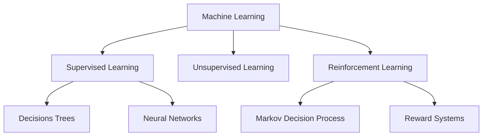

# AI Overview

Three Ways To Define AI:
+ As a system.
+ As a collection of computational techniques.
+ As a multidisciplinary research field.

## AI as a System

:::info Agent
An agent is anything that can be viewed as perceiving its environment through sensors and acting upon this environment through actuators.
:::

:::info Rational
A rational agent is an agent that selects actions in order to maximize its performance measure, given evidence provided by the percepts and andy built-in knowledge.
:::

## AI as a collection of techniques

### Machine Reasoning
Explicit knowledge representation + inferences to derive new knowledge.

Done by using propositional logic:
+ Pros
    + Precise Specification
    + Potentially more explainable
    + Open to  correction
+ Cons
    + Restricted expressiveness
    + Some knowledge hard to capture
    + Difficult to obtain all relevant knowledge.

### Optimization
Algorithms for finding the best solutions according to some criterion of optimality. for example number of steps, execution time...

### Machine Learning

+ Traditional programming takes input and logic (rules) and produces a output.
+ Machine Learning takes a mapping of input and output and produces logic (rules).

#### Supervised Machine Learning

+ Advantages
    + No need to model knowledge explicitly
    + Discover new relations between Input and output.
+ Challenges
    + handling noise.
    + handling biases in data.
    + optimization of generalization ability.
    + validation: performance with new data.

#### Security and ML
Ability to automate & generalize identification of new threats.

Domain specific challenges:
+ robustness against evasion attacks.
+ robustness against evolving attacks.

## AI as a research field

+ Views AI as as a socio-technical system.
+ Combines expertise from many fields:
    + cs
    + hci
    + psychology
    + law
    + etc...