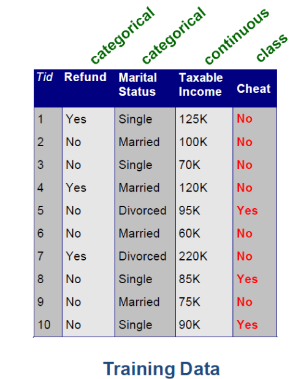
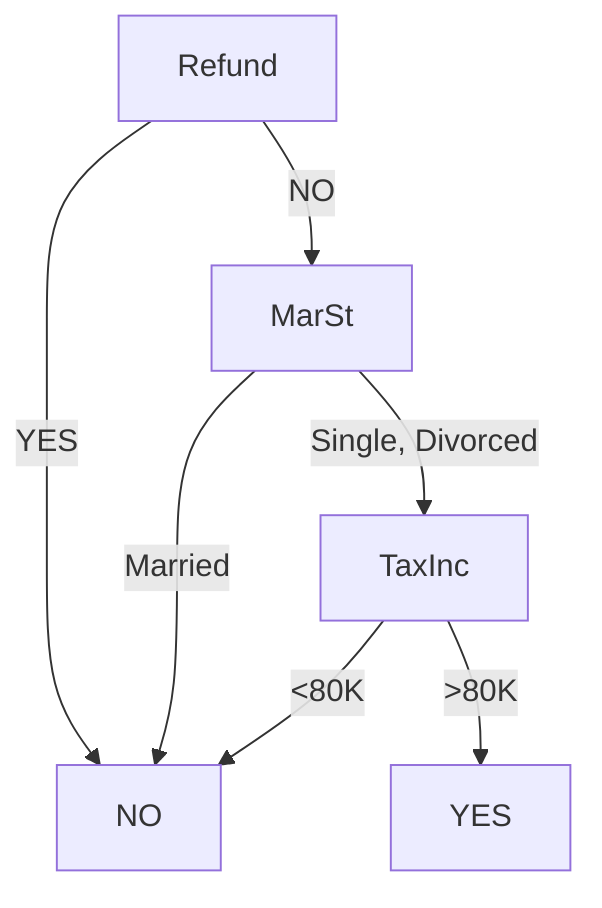

# Decision Trees for the same problem

+ Used for supervised learning
+ Tree-like model to fit the data
+ Easy to understand and interpret

``` mermaid
graph TD;
Refund -->|YES| NO;
Refund -->|NO| MarSt;
MarSt -->|Single, Divorced| TaxInc;
MarSt -->|Married| NO;
TaxInc -->|<80K| NO;
TaxInc -->|>80K| YES;
```

