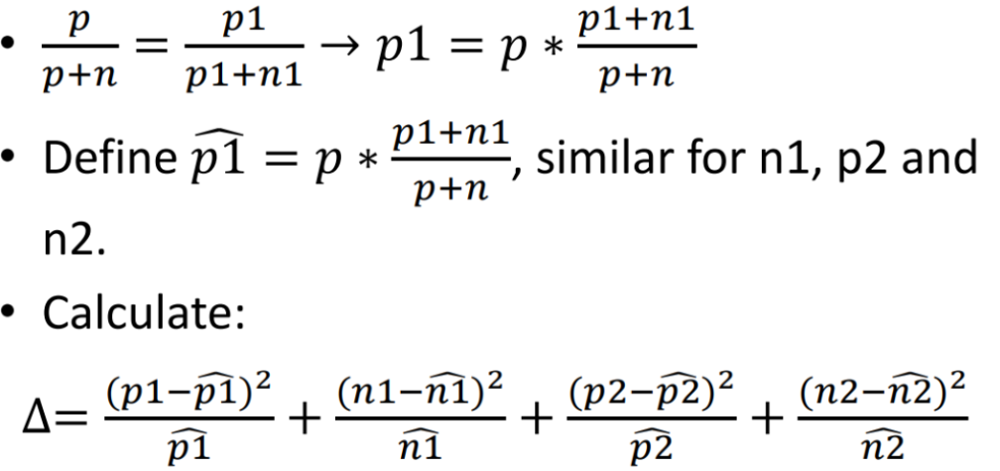

# Pruning Decision trees

Decision trees have a major drawback:
- They can grow too deep
- They overfit  
- How do we deal with a model that overfits?
- Remove splits that are not _statistically significant_

|     A | B | Class | 
| ---- | ------------ | --------- | 
| a1 | b1 | Y:50 N:0 |
| a1 | b2 | Y:0 N:50|
| a2 | b1 | Y:0 N:50|
| a2 | b2 | Y:50 N:0|

**A** and **B** have no information gain but in combination they can separate the classes.  

--------

```mermaid
graph TD;
A[Y:p AND N:n];
A --> B[Y:p1 AND N:n1]; 
A --> C[Y:p2 AND N:n2];
```  

_Remark: Y and N stand for number of yes and no in the dataset, respectively_

-----

No improvement then:

p/(p+n) = p1/(p1+n1) = p2(p2+n2)  

n/(p+n) = n1/(p1+n1) = n2(p2+n2) 

## Bottom-up Pruning

/_\ is X^2- distributed with 1 degree of freedom. In general d-1 degrees of freedom, with d as a number of splits.

Small values for /_\ imply **no** rejection of null hypothesis (Ho: no improvement) and hence pruning of tree.

