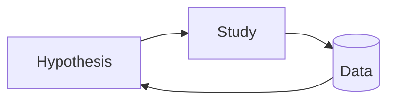
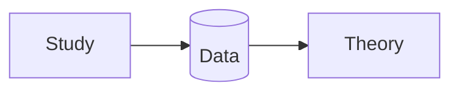

# Analyzing Qualitative Data

> Lazar Chapter 11.

Goal of analysis of data: `unstructured data -> detailed description`.

## Content Analysis

:::info Content Analysis
refers to the process of developing a representative description of text or other unstructured input.
:::

Types of content:
+ media content: content that is published.
+ magazine, personal website, youtube, tiktok ...
+ audience content: content you ask for.
+ surveys, questionnaires...

## Text Analysis
::: info coding
Assigning categories and descriptors to blocks of text.
Basically sorting parts of the text content into a set of commonly occurring categories.
:::

Coding schemes:
+ Emergent coding
    + without a theory or model to guide analysis.
+ A priori coding
    + using a theory or model to guide analysis.

### Grounded theory and emergent coding
Use this if you don't have categories to sort your text before starting.

Consists of four stages:
+ Open coding
    + Analyze the text and identify any interesting phenomena in the data 
    + Need to find terms to describe the interesting instances that emerge from the data 
    + In vivo code: coding categories derived from a participants vivid explanation 
+ Development of concepts
    + Collections of codes that describe similar contents are grouped together to form higher level ‘concepts’, which can then be grouped to form ‘categories’ 
    + Axial coding: the identification and definition of relationships between concepts 
+ Grouping concepts into categories
+ Formation of a theory
    + Aim at creating inferential and predictive statements about the phenomena recorded in the date
    + We develop explicit causal connections or correlations between the concepts and categories identified in the previous stages 
        + Might be followed by selective coding, in which previously coded data might be revisited from the context of the emerging theory

**Experimental Research**

**Grounded Theory**

## Multimedia Analysis

