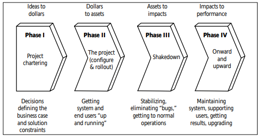

# Enterprise System Experience

the paper wants to provide a theoretical approach to finding how much value a enterprise system provides.

## Historical Context

1970s:
+ a single integrated system for the business was not made.
+ 'islands of automation' were created
  + programming a new application to solve a problem.
  + if the new application had to communicate with other apps it was done *loosely* or manually, rather than integrated tightly.
  + combining info from sales or manufacturing was difficult and error prone.
  + costs for maintaining systems grew, so no new systems could be built.

1980-1990s:
+ software developers start developing software packages that share a common database.
+ the developers claimed that it satisfied all the needs of businesses.
+ the software packages became known as ERPs.
+ large companies adopted them in the mid 1990s
+ by 1998 approx 40% of companies with revenue > 1 billion had ERP systems.
+ despite the benefits of ERPs the process of installing ERPs has not been smooth.

## Enterprise Systems

### Characteristics of Enterprise systems

+ **Integration**: how well the information flows through a company. depends how well the ERP is configured (which apps are added and the parameters chosen)
+ **Packages**: ERPs are bought or leased rather than being developed in house.
  + the company buying the ERP has to adapt to the ERP way of working and makes IT skills obsolete.
  + the company buying the ERP enters into a long term relationship with the provider of the ERP.
+ **Best Practices**: Since ERPs are designed to fit the needs of many companies so they support generic business processes. The generic process may be different from the way a particular business works. ERP vendors come up "best practices" based on interviewing companies and academic research. A best practice is supposed to be the best way to do a certain process, and is the way implemented in the ERP.
+ **Some Assembly Required**: ERPs have to be deployed to work. (i.e installing it on a server). Some companies need to code an interface between their old software with the new ERP. Some companies need 3rd party modules for their ERPs.
+ **Evolving**: ERPs are changing. 

### Reasons for adopting ERPs

| Reason | Small Companies | Large Companies |
| ------ | --------------- | --------------- |
| Technical | replace hard to maintain interfaces, integrate applications cross-functionality, reduce software maintenance burden through outsourcing, eliminate redundant data entry, improve it architecture, ease technology capacity constraints, decrease computer operating costs | same as small and consolidate multiple systems of the same type |
| Business | Accommodate business growth, acquire multilanguage and multi currency support, improve informal and or inefficient business processes, clean up data and records through standardization, reduce business operating and admin expenses, reduce inventory carrying costs, eliminate delays and errors in filling customers orders | same as small company and provide integrated IT support (for non IT employees), standardize different numbering, naming and coding schemes, standardize procedures across different locations, present a single face to the customer, acquire worldwide "available to promise" capability, streamline financial consolidations, improve companywide descision support |

### Reasons for not adopting ERPs
+ lack of feature function fit, companies have processes dictated by the industry they are in and the ERP does not provide good functionality for this way of doing things.
+ company growth: companies that continually change don't want to settle with one way of doing things.
+ alternatives for increasing integration. for example data warehousing or in house middleware.
Other mentioned reasons are: cost, competitive advantage and resistance to change, but these reasons are often not true.

## Framework

objectives:
+ why does success not always occur?
+ what can be done to improve the chances of success?

success metrics:
+ project metrics.
+ early operational metrics.
+ longer term business results.

Soh & Marcus Model.
+ high quality IT assets are not always sufficient for success.
+ IT investment to business value: phases of an IT project, output from one phase is input to the next.
+ both events and actions affect outcomes.

