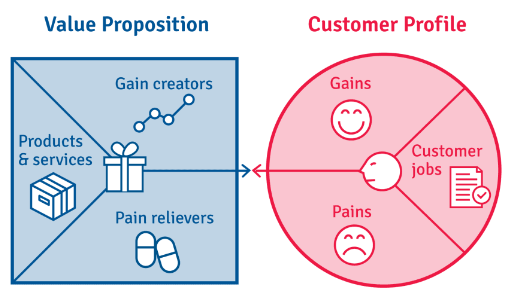

# Strategy and Business Modelling

:::info Strategy
Strategy is the creation of a unique and valuable position that is to gain a sustainable advantage over rivals by creating or preserving what's distinctive about your company.

A company's strategic position hinges on performing different activities from competitors or performing similar activities but in different ways.
:::

## How to focus offerings as your strategy core

+ Product
+ Customer
+ Region

## Five Force Model

| C