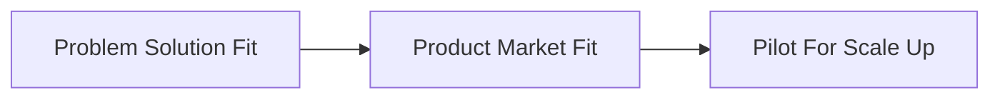

# PODB 5

## Generating Options

### Environment Scanning
+ Political, regulatory change.
+ Economic change.
+ Social change.
+ Technological change.

### Analogies
+ Lessons from adjacent industries.
+ Lessons from industries with similar cost and revenue.
+ Best practices in your industry.
+ Reverse benchmarking.
+ etc...

### Creativity Stimulators
+ Perfect World (around a specific need)
+ Opposites (looks whats's there and not)
+ Bouncing (between people)
+ Forced Comparison (to any object)
+ What if (a most unusual possibility works)
+ What else (could the product look like)
+ Different Chair (for each team member)
+ Dialetics (thesis, anti-thesis, synthesis)

### Business Theories
+ Customer needs
+ Unmet needs
+ Disruption theory
+ Jobs to be done
+ Customer journeys
+ Integrative Thinking
+ Core Capabilities
+ Etc...

## Generating Options

You can enhance your ideas by looking beyond the pure product.

Ten Types of Innovation:
+ Profit Model
+ Network
+ Structure
+ Process
+ Product Performance
+ Product System
+ Service
+ Channel Brand
+ Customer Engagement

Be sure to think through a handful of relevant ideas by describing then as a set of choices.

Main Strategy Choices:
+ Where to play?
  + products or services
  + customer segments
  + channels
+ How to win?
  + value proposition
  + defensible advantages
+ What capabilities ?
  + Knowledge
  + Tech
  + People
  + Customers
  + key partners
  + access to funding

## Evaluating Options

Because the future is chaotic, startups cannot plan ahead: they have to go through a three stage process and continuously refine their choices.

Three stages for launching a startup:

For any business to work three key things must be true. These things need to be tested.

| Attractiveness | Customers value | Capabilities |
| -------------- | --------------- | ------------ | 
| Market potential is large | Customers like our product or service | We offer lower costs or more value than competitors |
| Market is structurally profitable | Channels like our product or service | Competitors will not retaliate |

### Stage 1

"Quick and Dirty" tests to start with.

**Choice structuring for problem solution fit**

| reqs | attractiveness | Customers value | Capabilities |
| ---- | -------------- | --------------- | ----- |
| What needs to be true? | The market size is large, and its structure is attractive, There is a commercial model that appears financially attractive. | The problem is real, potential customers have shown initial interest | The concept is technically feasible |
| How to test this? | Gather existing data to estimate the size of the potential market, check for regulatory and other showstoppers | Undertake quick interviews with friends and fam to get a appeal measure | Create sketches, flow charts and wire frames of the idea and discuss with experts and friends, google competitors |

Examples:
+ driver tree: rough estimate of market.
+ five forces model: check if market is structurally profitable.
+ benefit ladder (product attributes => functional benefits => emotional benefits): helps filter interviews.

### Stage 2

**Choice structuring for problem market fit**

| reqs | attractiveness | Customers value | Capabilities |
| ---- | -------------- | --------------- | ------------ |
| What needs to be true? | Customers profitability looks positive, a conservative financial model shows the venture to be commercially viable | Early users "Alpha Testers" responded positively | The functional prototype works, competitor response is limited |
| How to test this ? | Build a basic financial model from a profit driver tree, with assumptions ready for testing, sense check the projections with others to ensure that the opportunity is still attractive | conduct small real world experiments to test key assumptions using digital tools ad prototypes (are customers giving time, money etc. or just because it is free?) | Demonstrate the MVP to experts/friends to get feedback, Wargame or think through competitor response |

Examples
+ HiFi Prototype

## Stage 3

When things get clearer you can switch "engineering mode" and continuously improve by measuring and analyzing key metrics.

**Choice structuring for pilot scale up**

| reqs | attractiveness | Customers value | Capabilities |
| ---- | -------------- | --------------- | ------------ |
| What needs to be true? | Metric targets can be achieved, the financial model still appears at  | Customers "beta testers" are repeatedly willing to spend money on the solution, customers have recommended the solution to others | All capabilities needed to scale and win remain available source-able |
| How to test this ? | Check the weekly metrics to determine areas of underperformance (and take remedial action) | Run targeted trial and A/B tests to continously improve sales and service elements | Gather feedback for fixes and additional features and use these to make an improved version available for testing |

