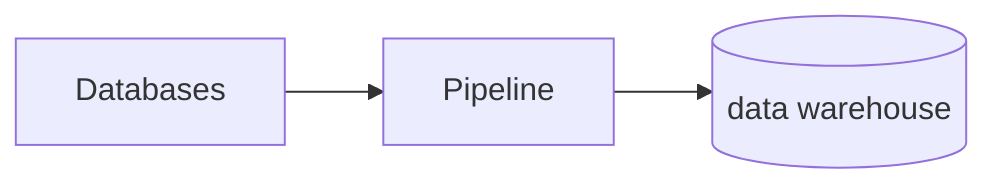

# Why Data Quality

::: tip **Data quality = fit for use**

Use:

- data will be **used** by customers in operations, decision making… (is the data qualified for this use.)
- data is **fit for use** if it is free of defects, possesses the features needed to complete the operation, decision, plan.

Fit for use:

- Free of defects
- Possesses the features needed to complete the operation.
- Exactly the right info, at the right place at the right time.
:::

- 🚧 Data use needs domain and data understanding to be useful 🚧

## What is data

::: tip Data
Consists of:
- Data Model
- Data Values
:::

::: tip Data Model
Also known as the data schema. Indicates what are the possible columns or attributes of each data record. And also indicates the types of the attributes.
:::

- not only the quality of the data but the quality of the **documentation matters.** (what do the attributes mean)

## Properties of Data that complicate it’s quality

- data multiplies
- data are more complex than they appear
- data are subtle and nuanced. They have become the organization’s lingua franca
- data create more value when they are *on the move*
- data are organic
- data can be digitized
- data are the means by which organizations encode knowledge. They are meta-assets.
- Data are intangible
- Each organization’s data are uniquely it’s own.

## Machine Learning

Data quality problems can influence the **Training Set** and the **Test set.**

## Business Perspective

How to get the data right in the organization. 

Data quality aspects:

- organizational
- architectural
- computational

### Organizational

::: tip 🚨 **Data Governance**
The collection of processes roles policies standards and metrics that ensure the effective and efficient use of information in enabling an organization to achieve its goals.
:::

- capture and understand (exploration and profiling)
- improve quality and security
- manage (data pipelines)
- control (review and monitor)
- document
- empower people (give people permission to ask for data quality)

### Why do organizations not make much improvement on data quality

- the business case for data quality is not very good
- social political and structural issues.
- data have properties unlike other assets ,but organizations have yet to take into account.
- some managers do not believe in the benefits of good quality data
- data quality programs have not yet fully embraced the *properties of data as a business asset*  lemma.
- Immature data markets

Management system for data should be covered by all management systems which makes it more complex.

**approach: focus on preventing errors at their sources.**

1. focus on the most important needs of the most important customers (daily)
2. apply relentless attention to process
3. manage all critical sources of data
4. measure quality at the source and in business terms (daily)
5. employ control at all levels to halt simple errors and move forward (daily)
6. develop a knack for continuous improvement (daily)
7. set and achieve aggressive targets for improvement
8. formalize management accountabilities for data (senior)
9. a broad, senior group leads the effort (senior)
10. recognize the hard issues are soft, and actively manage cultural change. (senior)

### Cost of poor data quality

- higher operation costs
- lower customer satisfaction
- lower employee morale
- lost sales
- lower trust between departments
- poorer / delayed decisions
- increased risk of acceptance of new tech
- more difficult to manage overall risk
- more difficult to set and execute strategy
- fewer options to “put data to work”
- harder to align the org
- distracts management attention
- threat to competitive position

### Data Quality Checklist

- people:
    - how many are needed
    - which skills
    - how to manage and educate them
    - job descriptions
- organization
    - where should they work
    - to whom should they report
    - business model
- management
    - accountability for everyone who touches data
    - connect data creators and customers
    - create feedback loops
- data
    - how to share
- culture

### Data Science Roles in Organizations

- Data Scientist: everyday data prep & analytics
- Data science specialist: complex data types, actions
- Data steward: governance (managing, securing data, supports users)
- Data curator: organizing, labelling, documenting
- Data controller (gdpr: entity determines the why and the how for processing data person)
- Chief Data Officer (mgmt team, enterprise wide gov, util of data as asset)

## Data Warehouse Architecture

**data quality dashboard**

Show these measures on a dashboard for the data warehouse:

- null values
- repairs
- completeness
- freshness

**Conclusion**

- data is dirty always
- data is always dirtier than you think.
- minute DQ problems can have severe impacts.
- data cleaning needs domain and data understanding
- data use needs domain and data understanding
- a data scientist should know and tell you about the deficiencies in the data and the results
- data can even have been manipulated on purpose.