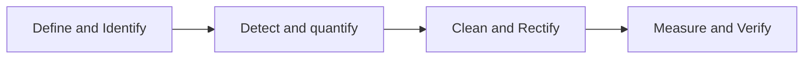

# Data Quality Process

test

**Data Glitches Examples:**

- missing data
- inconsistent data
- anomalies and outliers
- duplicates
- undocumented data

**Factors that complicate detection of glitches:**

- relevance:
    - severity varies depending on the domain
    - focus on the most relevant things
- ambiguity
    - boundary between good and bad is unclear
    - depending on the company
- complex dependencies
    - one glitch can mask another.
- dynamic:
    - not only new glitches appear, but also type of glitches changes.

**Classification of glitch complexes**

- multi-type glitch
    - a value has multiple glitch types associated with it.
- concomitant glitches
    - two or more values have glitches and appear in the same record.
- multi occurent glitches
    - same glitch type occurs in different records

## Detecting Glitches

- Missing data (values, records, attributes)
    - values: easy, records & attr: hard
- Inconsistent erroneous data (values, references)
    - (soft) constraint based
    - typical errors: spelling
- Anomalies and outliers (values, records)
    - statistical methods, ML-based methods
- semantic duplicate records
    - matching
- undocumented data

### Missing data Mechanisms

Categories:

- **MCAR**: missing completely at random
    - no correlation between missingness and any values, observed or missing.
    - Random subset of the data.
- **MAR**: missing at random
    - there is correlation between missing values and the observed data, but not the missing data.
    - example: only men respond to weight question on questionnaire. (weight is only filled in for men)
- **MNAR**: missing not at random
    - example: not everyone responds questionnaire, specific type of people.
    - relationship between missing rows and values (of the missing rows).

Deletion of rows requires MCAR; otherwise bias.

if you delete rows and missingness is not at random the model will be biased.

Data imputation methods assume not MNAR ⇒ imputation is replacing missing data with substituted values.

### Quantifying the number of glitches

counting the amount of glitches

- Per value
    - glitch signature: vector with glitch type indication bool
    - determine weights per glitch
    - glitch score of a value: weighted sum
- Global
    - Sum of all glitch scores

## Constraints

::: tip 🚧 **Constraint**
Any rule that should hold in your data.
:::

Data is a simplified abstraction of the real world, so any rule which holds in the real world could and should hold for your data.

- ssn are unique for people

Also called integrity constraints or semantic constraints.

A soft constraint is a rule that almost always holds, but there can be exceptions.

- name of employee is unique within org
- person enrolled in course implies person is student.

### Functional dependencies

Notation:

$X \to Y$

attributes X determine one value for attributes Y.

Example:

$Snum \to name$

`f(11) = “mark”`, f(11) cannot be any other value.

Formal Notation:
Students(snum, name)

$\forall x \forall y \forall z(Students(x,y)\land Students(x,z)\implies y=z)$

**Referential Integrity Constraints:**

Notation:

$Enrollment[snum] \subseteq Students[snum]$

*“every enrollment is done by a student”*

Formal Notation in predicate logic

$\forall x \forall y (Enrollment(x,y)\implies \exists Students(x,z))$

**Consistency**

Database D is consistent iff it satisfies all constraints.

To quantify:

- count the number of violations of each constraint
- Sum over all constraints (possibly weighted)

### Conditional Dependencies

::: tip ⏩ **Pattern Tableau**
a row template that if satisfied means that a certain functional dependency should apply to the row.
:::

::: tip ⚙ **Conditional Functional Dependency**
Defined by the pair $(X\to Y, T_p)$
where T is a pattern tableau and x → y is a functional dependency.
:::

Example:

$(country, zip \to street, city, T_1)$

T1:

| Country | Zip | Street | City |
| --- | --- | --- | --- |
| UK |  |  |  |

::: ➕ Conditional Inclusion Dependencies
Defined by the pair $(R_1[X;X_p]\subseteq R_2[Y;Y_p], T_p)$
$T_p$ is a pattern tableau.
:::

There are algorithms that can automatically discover CFD’s and CIND’s from a set of tables.

- There are also some algorithms that can discover them even if they do not hold perfectly in your data, but are valid up to a certain threshold of violations.
- Assuming we trust these discovered rules as true constraints to flag possible violating records and values.

## Finding Duplicates

Components of entity resolution

- entity reference extraction
- entity reference preparation
- entity reference resolution (comparaison of pairs: *same real world entity or not?)*
- entity identity information management
- entity analytics

### Entity Reference Preparation

- Data profiling
- Parsing
- Standardization
- Encoding
- Conversion (datatypes)
- Enhancement: adding info

### Data Profiling

Often used: pattern frequency analysis

replace digits with 9, capitals with A and lowercase with a.

then count occurrences of all the patterns.

⇒ find values of often occuring types: phone numbers, email, phone, credit cards.

### Entity Reference Resolution

Exact matching vs. probabilistic or fuzzy matching

Fuzzy matching with similarity functions:

- numerical
- syntactic
- semantic
- phonetic
- hybrid

### Jaccard Coefficient

$$
Jaccard(P,Q)=\frac{|P\cap Q|}{|P\cup Q|}
$$

Fraction of sharing between P and Q.

Example:

P=\{“J”,”o”,”h”,”n”,”D”,”o”,”e”\} → \{”e”,”h”,”n”,”o”,”D”,”J”\}

Q=\{“S”,”e”,”a”,”n”,”D”,”o”,”e”\} → \{“a”,”e”,”n”,”o”,”D”,”S”\}

Jacquard(P,Q) = 4/8 = 0.5

Images:

| 0 | 1 |
| --- | --- |
| 1 | 0 |
| 1 | 1 |

jaccard = tp / tp + fp + fn

jaccard = 

| 1 | 1 |
| --- | --- |
| 0 | 0 |
| 1 | 1 |

Insensitive to word order.

### Levenshtein Distance

$$
N\_Levenshtein = 1 - \frac{L(A,B)}{max(length(A))}
$$

L(A,B): number of manipulations to turn A into B

Example: JIM→JAMES needs 3 manipulations

Update I→A, insert E, insert S

So, Normalized Levenshtein = 1-3/5 = 0.4

### Jaro-Winkler Distance

$$
J(A,B) = W_1\frac{C}{L_A}+W_2\frac{C}{L_B}+W_3\frac{C-T}{C}
$$

W1+W2+W3 = 1

C: number of common characters

T: number of transpositions. (LE → EL)

Example:

$J(Shakler, shakel)= \frac{1}{3}\frac{6}{7}+\frac{1}{3}\frac{6}{6}+\frac{1}{3}\frac{6-1}{6}$

 

Jaro Winkler is a modification:

- N: number of first four characters that agree position

$W(A,B) = J(A,B) + 0.1 * N * (1.0 − J(A,B)))$

Example: 0.897+0.1*4(1.0-0.897) = 0.938

**Other distance metrics:**

- Smith-Waterman distance
    - longest common subexpression
- Q-gram distance aka n-gram
    - create substrings of length Q
    - “John Doe” → [“Joh”, “ohn”,”hn “,”n D”,” Do”,”Doe”]
    - Then use Jaccard or Jaro Winkler.

## Converting scores into probabilities

Common is to normalize:

- turns score into value between 0 and 1.
- But better is to use a probability.

better is to use `sim2p-mapping`

## Efficiency of entity mapping

`O(n^2)` complexity because entity matching needs to compare every record with every record.

- improvement: sorted neighbourhood method *(SNB)*
- avoid matching those that are not likely to match
- sort on a sorting key, match only in a sliding window.

Result of matching set of records S is a **partitioning**

- Partition of S is set of non empty subsets
- Union of subsets is S
- Intersection of each pair of subsets is empty
- Subsets are often called clusters

## Measuring and analyzing matching results

Measuring

- T is a partition obtained by correct linking (sample known)
- X is a partition obtained by our matching algorithm
- V is a partition formed by all non-empty intersections between true clusters(T) and process clusters (X)

**Talburt-Wang Index**

$$
TWI=\frac{\sqrt{|T|\cdot|X|}}{|V|}
$$

- E: set of pairs of records in T
- L: set of pairs in X
- ~E: pairs in S not in E,
- ~L: pairs in S not in L

False Positve Rate

$FPR=\frac{|L\cap\neg E|}{|\neg E|}$

False Negative Rate

$FNR=\frac{|\neg L \cap E|}{|E|}$

### Entity Information Management

We strive for

- Each RW entity has exactly one occurrence in the data
- Distinct RW entities have distinct occurrences

We have a cluster of records (duplicates)

- Survivor record EIS: keep the most complete one
- Attribute based EIS: surrogate record created with a most representative value for each attribute.
- Record based EIS: keep all possible records.

## Anomaly detection

Define or obtain a model of normal behavior

- measure likelihood or record/value to be generated by this model
- outlier are rare or inconsistent with the rest.

Categorization approaches

- supervised
- semi supervised
- unsupervised

- z-scores
- k-nearest neighbour K-NN
    - based on a distance measure, and a class measure.
    - the larger the distance to the knn the lower the local density the more likely the point is an outlier.
- autoencoders
    - neural network that learns to reconstruct it’s input.
    - using a middle layer or bottleneck, it has to compress and can only represent the most salient features.
    
    Train a model of a normal record in the table.
    
    Any value that is not reconstructed with similar value to the output is suspicious.