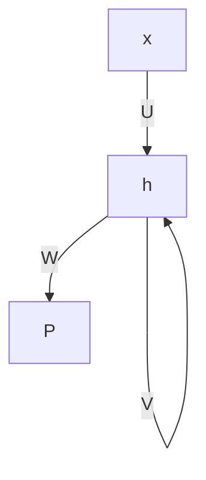
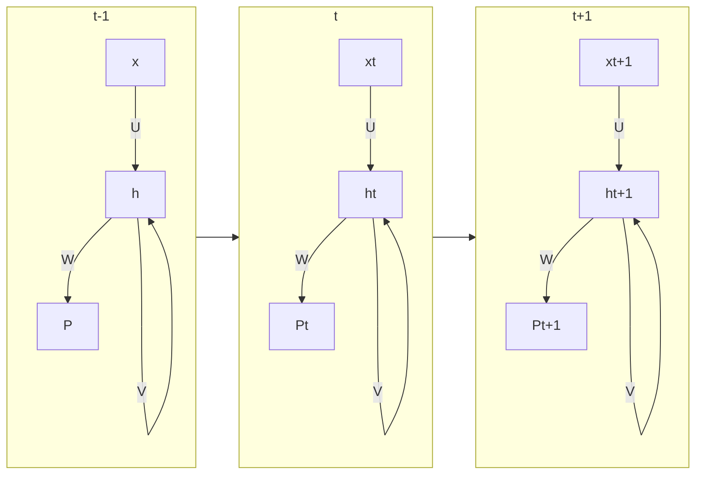

# Natural Language Processing Advanced

## BoW: bag of words approach

vector representation for our text documents: **document term matrix**

- simple to understand
- yields decent results in classification tasks
- makes an assumption that word order does not matter for classification

Sometimes word order matters:

“I like the book but I dislike the publisher” ⇒ +

“I like the publisher but I dislike the book” ⇒ -

N-grams can help, but they have a serious impact on the number of features of the dataset and some n-grams will not be relevant.

## Integer Encoding

- we can return each text as a sequence of integers
- each integer is the index of a token in a dictionary

```python
{
'book': 1,
'this': 2,
'i': 3,
'great': 4,
'it': 5,
'is': 6,
'boring': 15,
}
```

To create these integer sequences `tf.keras.preprocessing.text.Tokenizer` can be used.

## One Hot Encoding

1 vector per word in the sentence.


suffers from _curse of dimensionality_

⇒ very large sparse vectors.

**advantage of one hot encoding:**

$$
||w-w'||^2_2=2 \, if\, w\neq w'\\
||w-w'||=0\,if\, w=w'
$$

$||a-b||^2_2 = \sum^n_{i=1}(a_i-b_i)^2$

with integer encoding the model is mislead by the relation between the integers which represent the position in the map (this is completley meaningless, except for that common words are sorted first). With one hot encoding the model is not mislead.

## Embedding Vectors

```python
embeddings = Embedding(input_dim=vocab_size, output_dim=word_vec_size,
input_length=max_word_per_doc)
```

# Word to Vec

💡 We can know a word by the company it keeps.

## CBOW

continous bag of words.

- predict a word from a window of surrounding context words
- the word order is removed.

Goal: predict a focus word.

Context → Focus

window size = 2 (two words before and two words after)

Input: the, semester, take, exams

Output: students

since we don’t need explicitly labeled data this is an unsupervised problem.


size of the hidden layer is a hyperparameter = size of the embedding vector.

## Skip-Gram

Focus → Context

## Other word embeddings

- word2vec - google
  - skip gram outperforms CBOW with rare words
- glove - standford
  - works on a word to word co-occurence matrix
  - applies dim reduction techniques on the resulting matrix

word2vec & glove provides pretrained embedding layers

[pretrained word to vec](https://code.google.com/archive/p/word2vec/)

- use keyedvectors from the Gensim library

```python
file = 'GoogleNews-vectors-negative300.bin'
word2vec = KeyedVectors.load_word2vec_format(file, binary=True)
```

```python
word2vec.most_similar(positive = ["King", "Woman"], negative = ["Man"], topn=1)
```

This is relevant for us when passing the tokens of oru documents to the embedding layer.

⇒ now we can prevent the model from learnign the weights based on our corpus, and rather pass the ones fromm word2vec directly.

# Recurrent Neural Networks

We looked at a feed forward networks. ⇒ no loops

we invested in cleaning the text in an effort to reduce the feature space.

the input layer is equivalent in size to the vocab size.

- we have come up with vector representations that keep the word order
- now we need to come up with a network structure that can benefit from this representation

The idea 💡 is to input one token at a time, and calculate an activation, possbily an output as well.

the activation of the previous iteration is used alongside the next input token to make a new prediction.



t-1: I

t: like

t+1: the



RNNs can be classifed based on number of input/output.


1. Image classification
2. Image captioning
3. Text classification
4. Translation (non equivalent input and output length)
5. part of speech tagging, for each input there is a syntactic role.

## Forward Pass

$$
h^t = \sigma(x^t\cdot U + h^{t-1}\cdot V+b_h)\\
p^t = \sigma(h^t\cdot W+b_0)
$$

## Back Propagation

- gradient for W

$$
\frac{\delta L}{\delta W}=\frac{\delta L}{\delta p}\cdot\frac{\delta p}{\delta W}
$$

- gradient for weights V (back propagation through time)

$$
\frac{\delta h^t}{\delta h^t}= \prod^t_{i=k+1}\frac{\delta h^i}{\delta h^{(i-1)}}
$$

Problems:

- exploding gradients
  - gradient clipping
- vanishing gradients
  - truncated backpropagation

# LSTM

Long term short term memory LSTM RNNs

- uses a cell state
- uses the concept of gates

Gates:

- forget gate `F`
- Input gate `I`
- Output gate `O`


cell state remembers long term dependencies:

- it decides which inputs are added to the cell state
- it decides which inputs need to be remembered or forgotten

### Forward Pass

**forget gate**

sigmoid 1 or 0 used to decide if forget or remember word.

$$
f_t =\sigma(W_fx_t+U_fh_{t-1}+b_f)
$$

**Input gate**:

allows new info to flow into the cell state.

$$
i_t = \sigma_g(W_ix_t+U_ih_{t-1}+b_i)
$$

combined:

$$
\tilde{c}_t=\sigma_c(W_cx_t+U_ch_{t-1}+b_c)
$$

activation function tanh, sets the squashes the output to either 1 or -1.


Updating the cell state:

$$
c_t =f_t * c_{t-1} + i_t * \tilde{c}_t\\
h_t=o_t*\sigma_h(c_t)
$$

# Other RNNs and Applications

## Gated Recurring Unit

- no cell state
- two gates instead of 3
  
  $Z_t = \sigma(W_zx_t+U_Zh_{t-1}+b_Z)$
  $R_t = \sigma(W_Rx_t+U_Rh_{t-1}+b_R)$
  $h_t=Z_t*h_{t-1}+(1-Z_t)*tanh(W_hx_t+U_h(R_t*h_{t-1})+b_h)$
  ## RNNs In Keras

```python
model = Sequential()
model.add(Embedding(input_dim=24, output_dim=5, input_length=8, trainable=False))

model.add(SimpleRNN(1))

model.add(Dense(1, activation='sigmoid'))

model.summary()
```


LSTM:

```python
model = Sequential()
model.add(Embedding(input_dim=24, output_dim=5, input_length=8, trainable=False))

model.add(LSTM(1))

model.add(Dense(1, activation='sigmoid'))

model.summary()
```


```python
model = Sequential()
model.add(Embedding(input_dim=24, output_dim=5, input_length=8, trainable=False))

model.add(LSTM(1))

model.add(Dense(1, activation='sigmoid'))

model.summary()
```


= 100 (4*5+4*100+4)

= 42400

## Applications of RNNs

### Natural Language Generation

one to many

### Part of speach tagging

- many to many RNN,we output from each timestep
- TimeDistributed(Dense()) should wrap your dense layer to achieve this.

### Stacked RNNs

The problem at hand might be complex, a single layer of RNN with hidden units might not be enough to learn an appropriate model.

### Bidirectional RNNs

Training RNN in two opposite directions might also help you learn a better model

use the `BiDirectional(LSTM())` wrapper
