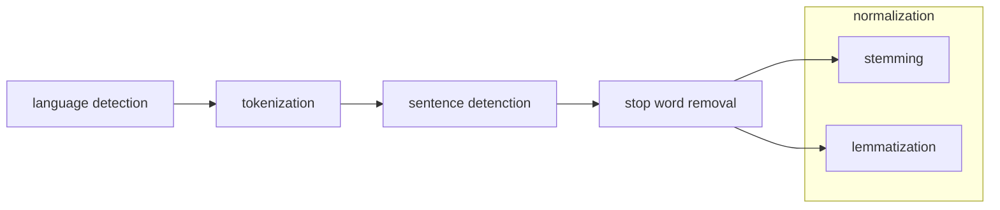
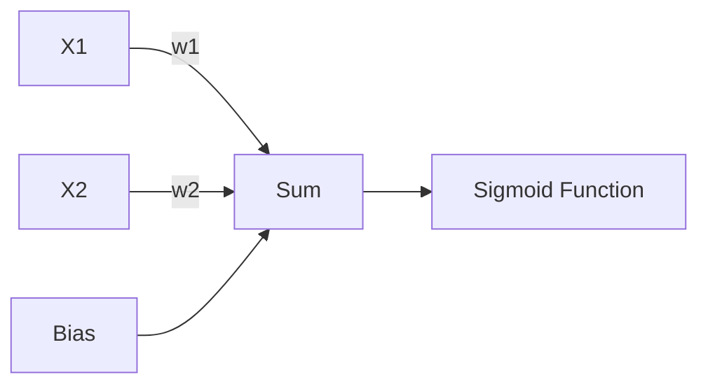

# Natural Language Processing Basic

:::info NLP
Natural Language Processing (NLP) is a multidisciplinary field that focuses on the development and application of computational techniques to enable computers to understand, interpret, and generate human language.
:::

## Text Processing

- text is a sequence:
  - of characters
  - **words (most used by nlp practicioners)**
  - sentences

Text preprocessing techniques change depending on the task. For text classification. we will need the following:

- language detection
- detect term boundaries (tokenization)
- detect sentence boundaries.
- remove stop words
- normalization (stemming or lemmatization)



### Tokenization

<aside>
<!--  **Tokenization** Splitting a sentence into smaller chunks (tokens) -->

</aside>

There are different implementations of tokenizers:

- white space tokenizer (based only on spaces)
- word punctuation tokenizer (based on spaces and punctuation)
- tree bank word tokenizer (uses a _corpus_ of words)

tokenize using _spacy_, _GenSim_, _Keras_ or just using `split()` from Python 🐍

```python
from nltk import word_tokenize

def tokenize(X):
	return X.apply(lambda x: word_tokenize(x))
```

### Normalization

<br />
<details>
<summary>example:</summary>
  query for NLP, should also return documents containing “nlp”
  queries for documents with the word “joked” should return documents with the words “joke”, “jokes”, “joking” etc…
</details>

Two approaches possible:

- **stemming** - reducing inflected words back to their stem.
- **lemmatization** - reducing inflected words to thier dictionary form.

_inflected word = word + affix_


**Stemming vs Lemmatization**


**Porter stemmer**

- set of rules applied in a sequential order.
- not necesarily a valid word.
- does well with verbs.

```python
def stem(X):
    stemmer = PorterStemmer()
    X = X.apply(lambda x: [stemmer.stem(word) for word in x])
    return X
```

**Lemmatization:**

- reduction of inflected forms to the proper dictionary form.
- relies on a corpus, making it slower than stemming
- with _NLTK_ you might need to use `WordNetLemmatizer`

**Language Detection**

- simplest approach ⇒ letter frequencies.
- more elaborate methods look at statistics over more than one letter (n-grams).

**Sentence Detection**

- naive approach: “?”, “!” and “.”
- solution: build a binary classifier to decide for each period whether it’s a sentence boundary or not.

**Stop Words**

- common words that appear in all documents.
- their occurrence doesn’t characterize text.

## Regular Expressions

Patters that allow to match character combinations. _Regex_

- `[Aa]` matches either A or a
- Range: `[A-Za-z0-9]` matches all alphabet all cases and all numbers.
- Negation `[^A-Z]` match all except capitals
- disjunction `red|green` matches either red or green
- question mark ?: `colou?r` matches either colour or color
- asterisk: `wo*w` matches zero or more occurences of the previous character. matches ww, wow, woow, woooooow.
- plus: `wo+w` one or more of the previouse character, wow, woow, wooooow.
- dot: `end.` matches exactly one character
- escape \: escpaes special characters `end\` matches end.
- Carat: represents the start of a string `^[A-Z]` matches all strings that start with a capital.
- word boundary \b: `\bha\b` matches ha but not hahahah

## Bag of Words

**document term matrix** → vectorspace model

occurence of words per document:

one major drawback is that the word order is lost: this is a Bag of Words (BoW)

- consider bi-grams instead of unigrams (n-gram model)

What to do with:

- high freq n-grams
- low freq n-grams
- med freq n-grams

high freq → if a term appears in every document it does not give any meaningful info.

low freq → can be a typo.

med freq → perfect.

**Term Weighting**

grade a word’s discriminative power.

**TF**: term frequency, i.e. word count, captures how important a word is for a document.

**TF-IDF** weighting scheme aims to capture this by downweighting common words.:

- _tf_ - term frequency, number of times t occurs in document d
- _N_ - total number of documents
- _dft_ - document frequency, number of documents term d occurs in
- _idft_ - inverse document frequency

$$
⁍
$$

Example:

$W_{book, 4} = 2\cdot log(\frac{8}{5})$

$$
w_{i,j} = \text{\#times word appears in document}\cdot log(\frac{\text{document count}}{\text{\#times documents word is in}})
$$

- we want to keep the goldilocks terms ⇒ medium weight.

## Logistic Regression

- linear classifier that assigns a weight to each feature.
- No guarantee that the sum of the weights by the features will be between 0 and 1
- A sigmoid function enforces that



Formula Sum part:

$$
z = b + \sum_{i=0}^{i=nf}x_i\cdot w_i
$$

Formula sigmoid function:

$$
\sigma(z) = \frac{1}{1+e^{-z}}
$$


Result is P which is a prediction between `[0, 1]`

### Logistic Regression

We need to find the optimal weights for `w` and `b`

Two ingredients are needed:

- loss function. - logistic loss
- an algorithim to optimize our loss function - gradient descent

$$
Loss(W, b) = \frac{1}{ne}\sum_{i=0}^{i=ne}[y_ilog(p_i)+(1-y_i)log(1-p_i)]
$$


1. initialize weights and bias to a random initial value.
2. calculate loss.

$w = w-\alpha \frac{\delta Loss}{\delta w}$

$b = b-\alpha \frac{\delta Loss}{\delta b}$

## Forward Pass

In the forward pass, we multiply the weights by the features of the examples in our dataset.

We can rewrite z in a vectorized form as well.

$z=b+Xe^1 \cdot W$

where:

$X = \begin{bmatrix}           x_{1} \\
           x_{2} \\
           \vdots \\
           x_{n}
         \end{bmatrix}$

$W = \begin{bmatrix}           w_{1} \\
           w_{2} \\
           \vdots \\
           w_{n}
         \end{bmatrix}$

- it would be more efficient to do a forward pass for all examples in the dataset. in which case we can rewrite Z as $Z = b+X\cdot W$

X is a matrix with the rows = number of documents and columns = number of features (words).

W is a vector with 1 column and the rows = number of features.

Finally we can apply the sigmoid function to the vector Z.

Result is a vector of predictions P which is also of shape (8,1)

### Implementation

```python
'''
First we need to define a function which takes our
dataset as input and returns a vector W and a scalar b
with some random values.
'''
def initialize(X):
	b = np.random.rand()
	W = np.random.rand(X.shape[1], 1)
	return W, b

'''
Takes our dataset X, our vector of weights W and our bias,
produces a vector of predictions.
'''
def forward_pass(X, W, b):
	sigmoid = lambda z: 1/(1+np.exp(-z))
	return sigmoid(X.dot(W)+b)

```

## Back Propagation

With our forward pass completed, we can calculate the loss or the cost function for our model and get an idea of how good our weights and bias are.

The next step is to modify the weights and bias in such a way to optimize the loss function.

To optimize our loss function we need an algorithm called **gradient descent** in which we take the derivative of the loss function with regards to the vector W, and the derivative with regards to the bias b.

$$
⁍
$$

$$
\frac{\delta Loss}{\delta b} = \frac{1}{ne}\sum(P-y)
$$

### Implementation

We need to implement the equations:

$dW = \frac{1}{ne}X^T \cdot (P-y)$

$W = W -\alpha dW$

$db = \frac{1}{ne}\sum(P-y)$

$b=b-\alpha db$

```python
def gradient_descent(X, W, b, P, y, lr):
	inverse_no = 1/X.shape[0]
  dW = (np.transpose(X).dot(P - y)) * inverse_no
  W = W - lr * dW
  b = b - lr * inverse_no * sum(P - y)
  return W, b
```

## Learning Algorithm

1. initialize **W** and **b** with some random values
2. repreat for a predefined number of iterations (epochs):
   1. Forward Pass
   2. Gradient Descent
3. Return the final values for W and b

**Small changes to avoid problems:**

- define a infinitely small epsilon for the loss function:
- avoids crashes when model predicts null or 1

$Loss(W, b)=-\frac{1}{ne}\sum_{i=0}^{i=ne}[y_ilog(p_i+\epsilon)+(1-y_i)log(1-p_i+\epsilon)]$

- overflow can be encountered with sigmoid function if input is too big.
- solution: feature scaling.
