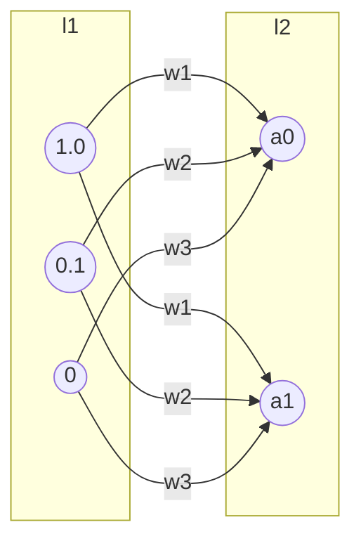
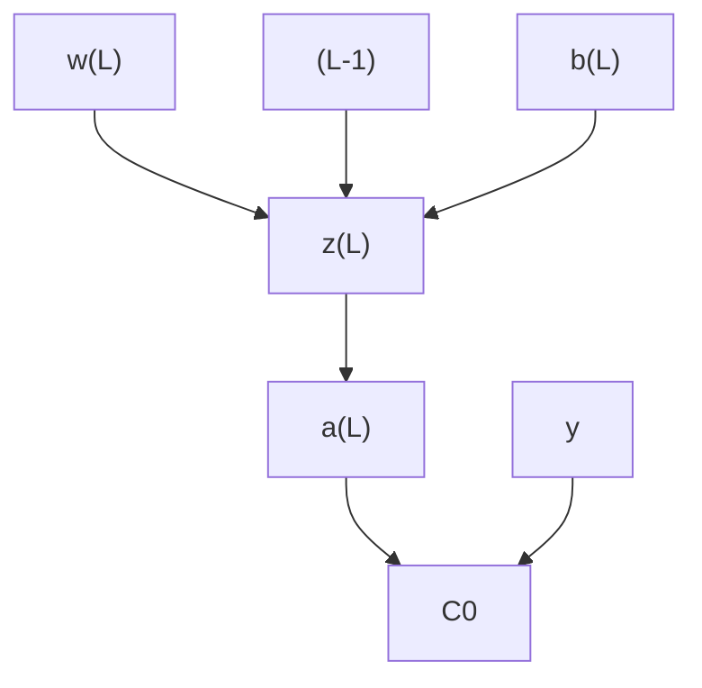

# Computer Vision

::: info
Ultimate goal of computer vision ⇒ Emulate human vision
Getting the computer to derive meaningful information from digital images.
:::

## What is an image ?

### Mathematical Perspective

::: info
An image is a function that quantifies light-intensity $f(x,y)$
:::

*for a grayscale image, the image maps each 2d point to a level of light intensity.*

$$
(x,y) \mapsto I(x,y)
$$

---

*for an rgb image the image maps each 2d point to a vector of 3 numbers which hold the level of red, green and blue.*

$$
(x,y) \mapsto \begin{bmatrix}
           r(x,y) \\
           g(x,y) \\
           b(x,y
         \end{bmatrix}
$$

### Computer Perspective

::: info
 An image is a matrix with the dimensions `(h, w, 1)`
`(h, w, 3)` for rgb images.
:::

There are differrent pixel formats. We consider:

- L for grayscale.
- RGB
- 1 (black and white)

🐍 Python library: `PILLOW`

- allows to extract the mode of pixels used
    - look up the attribute mode of the library Image.
    - you can convert from one mode to another.

An image loaded with `PIL` or other, needs to be converted to a `numpy` array.

```python
img = np.array(image)
```

- the shape of the img would then be `(h, w, 1)` or `(h, w, 3)`

## Geometric Transformations

- Known also as image wraping
- Transformations that concern the shape of the image (the domain) and not the brightness/intensity (range) of the pixels themselves.

Idea of using transformations is to do **data augmentation.**

⇒ create more data out of thin air using transformations on images.

### Image Scaling

To scale a point x,y:

$$
\begin{bmatrix}
 x' \\
 y'
\end{bmatrix}
= S \begin{bmatrix}
x \\
y
\end{bmatrix}
\\
\begin{bmatrix}
 x' \\
 y'
\end{bmatrix} = \begin{bmatrix}
 \lambda_1 & 0 \\
 0 & \lambda_2 
\end{bmatrix}\begin{bmatrix}
 x \\
 y
\end{bmatrix}
$$

To reverse this operation:

$$
\begin{bmatrix}
 x \\
 y
\end{bmatrix}
= S^{-1} \begin{bmatrix}
x' \\
y'
\end{bmatrix}
=\begin{bmatrix}
 \frac{1}{\lambda_1} & 0 \\
 0 & \frac{1}{\lambda_2} 
\end{bmatrix}\begin{bmatrix}
 x' \\
 y'
\end{bmatrix}
$$

### Image Rotation

$$
\begin{bmatrix}
 x' \\
 y'
\end{bmatrix}
= R \begin{bmatrix}
x \\
y
\end{bmatrix}
\\
\begin{bmatrix}
 x' \\
 y'
\end{bmatrix} = \begin{bmatrix}
 cos\theta & -sin\theta \\
 sin\theta & cos\theta
\end{bmatrix}\begin{bmatrix}
 x \\
 y
\end{bmatrix}
$$

### Image Mirroring

$$
\begin{bmatrix}
 x' \\
 y'
\end{bmatrix}
= M \begin{bmatrix}
x \\
y
\end{bmatrix}
\\
\begin{bmatrix}
 x' \\
 y'
\end{bmatrix} = \begin{bmatrix}
 -1 & 0 \\
 0 & 1
\end{bmatrix}\begin{bmatrix}
 x \\
 y
\end{bmatrix}
$$

## Edge Detection

::: info
A rapid change in light intensity in a small region.
finding discontinuity in image brightness.
:::

- useful in detecting objects in an image, as edges mark the boundaries of objects.
- useful in image segmentation.
- extract information from an image.

One way of detecting edges is to apply a **filter** to the image to highlight the light intestities.

- prewitt filter
- sobel filter

## Deep Neural Networks

stack logistic neurons.

- input layer
- hidden layers
- output layer

Works the same way as logistic regression:

- forward pass
    - weights * input + bias⇒ result
- loss or cost function asses the quality of the prediction.
- back propagation: improve the weights and biases.

parameters = # weights + # biases

loss functions:

- mean squared error
- mean absolute loss
- cross entropy
- binary cross entropy



$$
\sigma(\begin{bmatrix}
 w_{0,0} & w_{0,1} & w_{0,2} \\
 w_{1,0} & w_{1,1} & w_{1,2} \\
\end{bmatrix}\cdot
\begin{bmatrix}
 a_0^{(0)} \\
 a_1^{(0)} \\
 a_2^{(0)}
\end{bmatrix}
+
\begin{bmatrix}
 b_0 \\
 b_1 \\
\end{bmatrix})
$$

$$
\sigma(\begin{bmatrix}
 0.1 & 2 & 0.5 \\
 4 & 1.2 & 0.2 \\
\end{bmatrix}\cdot
\begin{bmatrix}
 1.0 \\
 0.1 \\
 0
\end{bmatrix}
+
\begin{bmatrix}
 2 \\
 -10 \\
\end{bmatrix})
$$

**Shape Check**

(2, 3) . (3,1) ⇒ (2, 1)

(2, 1) + (2, 1) ⇒ (2, 1)

(neurons l2, neurons l1) (neurons l1, 1) + (neurons l2, 1)

(neurons l2, neurons l1) (neurons l1, training set rows) + (neurons l2, 1)* 

*broadcasted, to number of training set rows.

## Forward Pass

binary classification ⇒ 1 neuron

multi class classification ⇒ as many neurons as classes

$$
Z^{[L]}= w^{[L]}\cdot A^{[L-1]}+b^{[L]}\\
A^{[L]} = \sigma(Z^{[L]})
$$

## Log Loss

:::info **Cross-entropy loss**, or **log loss**
measures the performance of a classification model whose output is a probability value between 0 and 1. Cross-entropy loss increases as the predicted probability diverges from the actual label.
:::

**Formula:**

$$
Loss(W, b) = -\frac{1}{ne}\sum^{ne}_{i=0}[y_i log(p_i)+(1-y_i)log(1-p_i)]
$$

- ***variables***
    
    **ne**: number of exemplaires, training rows.
    
    **yi**: binary indicator (0/1) if class label c is correct classification for observation 
    
    **pi**: predicted probability observation o is of class c
    

*So predicting a probability of .012 when the actual observation label is 1 would be bad and result in a high loss value. A perfect model would have a log loss of 0.*


The graph shows the range of possible loss values given a true observation (isDog = 1). As the predicted probability approaches 1, log loss slowly decreases. As the predicted probability decreases, however, the log loss increases rapidly. Log loss penalizes both types of errors, but especially those predictions that are confident and wrong!

## Back Propagation

Tweak all the parameters of the network to minimize the used **loss function.**

- we need to find out how to tweak the vector w of layer L
- we need to find out how to tweak the vector b of layer L
- recursively on all layers.



We want to check how sensitive is C0 to small nudges in **w / b**

also known as $\frac{\delta C_0}{\delta w}$

how w affects C0 is via w → z → a → C0

how b affects CO is via b → z → a → C0

$$
\frac{\delta C_0}{\delta w} = \frac{\delta z}{\delta w}\cdot\frac{\delta a}{\delta z}\cdot\frac{\delta C_0}{\delta a}
$$

$$
\frac{\delta C_0}{\delta b} = \frac{\delta z}{\delta b}\cdot\frac{\delta a}{\delta z}\cdot\frac{\delta C_0}{\delta a}
$$

there is a term defined dZ, which is $dz =\frac{\delta Loss}{\delta a}\frac{\delta a}{\delta z}$

We need to take these partial derivatives. The results are:

- $dz^{[fl]} = a^{[fl]} -y$
- $dz^{[l-1]} = W^{[l]}X^T\cdot dz*A^{[l-1]}(1-a^{[l-1]})$
- $dW^{[l]} = \frac{1}{ne}(dZ^{[l]}\cdot A^{[l-1]}X^T)$
- $db^{[l]}=\frac{1}{ne}\sum dz^{[l]}$

**Example:**

- $dz^{[2]} = a^{[2]} -y$
- $dz^{[1]} = W^{[2]^T}\cdot dz*A^{[1]}(1-a^{[1]})$
- $dW^{[2]} = \frac{1}{ne}(dZ^{[2]}\cdot A^{[1]^T})$
- $db^{[2]}=\frac{1}{ne}\sum dz^{[2]}$
- $dW^{[1]} = \frac{1}{ne}(dZ^{[2]}\cdot X^T)$
- $db^{[1]}=\frac{1}{ne}\sum dz^{[1]}$

## Learning Algorithm

1. init W and b to random values.
2. repeat for a predefined number of iterations
    1. forward pass
    2. gradient descent
3. return the final values for W and b

### Sigmoid

image values can go from `0 - 255`

⇒ feature scaling

### Exploding and vanishing gradients

- if your neural network grows deep you might suffer a problem with vanishing or exploding gradients.
- the w updates start from the output later and progress towards the layer bp.
- the w updates diminish as they traverse the network backwards, leaving some of the W of the earlier layers almost unchanged.
- similarly when you init you model params, your cost function may be too high impacting the updates of these parameters causing exploding gradients.
- sigmoid also problematic

### Overfitting

:::info
Your model might memorize the data and is not able to generalize.
⇒ add some noise to your data.
⇒ data augmentation
⇒ dropout
:::

### Multiclassification

- **binary classification**
    - log loss / binary cross entropy
    - softmax
- **multiclassification**
    - ~~binary~~ cross entropy
    - softmax
    

$$
softmax(z_i)=\frac{ez^i}{\sum e^{zk}}
$$

$$
Loss(W, b) = -\sum^C_c y log p
$$

- variables
    
    y ⇒ hot encoded ground truth
    
    p ⇒ probability distribution
    

- $dz^{[2]} = A^{[2]}-y$
- $dZ^{[fl]} = A^{[fl]}-y$

# Convolutional Neural Networks

process of applying a filter to an image ⇒ convolution

Prewit filter


Feature Map Size = image height - kernel height + 1, image width - kernel width + 1

(6 - 3 + 1, 6-3+1) ⇒ (4, 4)

assuming stride = 1

## STRIDE

- horizontal stride = step to the right
- vertical stride = step down
- if you don’t pick stride properly you ignore parts of the image.

The new Image size given if a kernel is applied is:

$$
(\frac{n-k}{S}+1, \frac{n-k}{S}+1)
$$

## Padding

- to keep the dimensions of the image in the output we apply padding.
- solve the issue of the image reducing in size. in this way we can apply lots of filters.
- extra advantage: more visits to pixels, information is more present in the output.

for example padding 6x6 image to 8x8.

(8-3+1, 8-3+1) ⇒ (6,6)

## Filters

- laplacian
- sobel
- prewitt

Prior to the emergence of deep learning, human experts detected these filters.

With deep learning we can learn the right filters for he task at hand. (classification, recongnition, deblur, …etc)

## ReLU

- Our initial image is made of pixels, each of which quantifies the intensity of light (positive)
- while training our model, the value of the kernel might be negative, resulting in negative values for these pixels in the feature map. (output image)
- suffices to convert the negative values to zero using ReLU


## Max Pooling

- locality of pixel dependencies
    - neighboring pixels tend to be correlated.
    - high intensity ⇒ neighbour high likelyhood of being high aswell.
- we can reduce the size of an image by considering only a pixel per block of pixels (size becomes a hyperparameter)


::: info **Max Pooling**
kernel (2, 2),
Stride = 2
:::

Resulting Matrix Size:
For an image of 4 x 4:

**(4-2)/2 +1** 

**⇒ (2,2)**

## CNN Layers

1. input
2. filter
3. pooling ⇒ repeat.
4. flattened input
5. Deep Neural Network

Example network:

```python
model = keras.models.Sequential()

model.add(keras.layers.Input((28, 28, 1)))

model.add(keras.layers.Conv2D(8, (3, 3), activation='relu')
model.add(keras.layers.MaxPooling2D((2,2))

model.add(keras.layers.Conv2D(32, (3, 3), activation='relu')
model.add(keras.layers.MaxPooling2D((2,2))

model.add(keras.layers.Flatten())
model.add(keras.layers.Dense(100, activation='sigmoid')
model.add(keras.layers.Dense(1, activation='sigmoid')
```

The generated model takes the grayscale (28 x 28) picture, and applies 8 different filters to it. These filters are learned thanks to gradient descent. The layer outputs 26 x 26 images to the next layer. The next layer is max pooling which reduces the image to a 13 x 13 representation by taking the maximum ‘pixel’ value found, in the 2 x 2 regions. This process is then repeated but with 32 filters. the outputs being first of shape 11, 11, 32 then 5, 5 32. After this convolutional part the image is passed on too the Deep Neural Network. this has to be done by flattening the 32: 5 x 5 images this generates a 800 pixel array. This pixel array is the input which is connected to a layer of 100 neurons, which then goes to the output classification with one neuron.