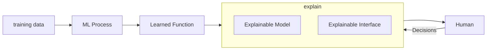

# Explainable AI

::: info 🤯 Explainable AI
is a set of methods and tools that can be adopted to make Machine Learning models understandable to human beings. XAI (e**X**plainable **AI**) provides the tools to understand why a decision or output a machine learning model makes.
:::

## XAI Manifesto

Explainable AI should be **FAST**:

- Fair
- Accountable on it’s decisions
- Secure to outside hacking
- Transparent in its internals

## Interpretability vs Explainability

::: tip ❄️ Interpretability
Interpretability is the degree to which a human can consistently predict the model’s result.
:::

::: tip ❓ Explainability
Explainability is the degree to which a human can explain why a decision/output of a model is what it is.
:::

| Question | Interpretability | Explainability |
| --- | --- | --- |
| Which are the most important features that are adopted to generate the prediction or classification | Yes | Yes |
| How much the output depends on small changes in the input. | Yes | Yes |
| Is the model relying on a good range of data to select the most important features | Yes | Yes |
| What are the cirteria adopted to come to the decision  | Yes | Yes |
| How would the output change if we put different values in a feature not present in the data | No | Yes |
| What would happen to the output if some feature or data had not occurred. | No | Yes |

## Centaur XAI System

Classifier follows the notion that since ML model may be unsure, it can ask the Human for help.

## Pareto Principle

AI Driven Results: 80%

Human Driven Results: 20%

## Evaluation of XAI Models

1. **Application-grounded evaluation**: this approach regards humans trying to complete real tasks relying on the produced explanations coming from the application of XAI to the ML system.
2. **Human grounded evaluation**: in this case we don’t have domain experts but just lay humans to judge the explanations. The evaluation approach depends on the quality of explanation independently from the associated prediction.
3. **functional grounded evaluation**: this kind of evaluation is usually adopted when there are already a set of models that have been validated by human-grounded experiments as explainable which are then used as a proxy for the real model. They are used when there is no access to humans to perform evaluation.

The level of explainability has to be assessed by a human with different knowledge of the domain and different needs from case to case (up to the point that the evaluation may not include humans at all as in the functionally grounded approach)

## Properties of a good explanation

1. Completeness
2. Expressive power
3. Translucency
4. Portability
5. Algorithmic Complexity
6. Accuracy
7. 
8. Consistency
9. Stability

## Taxonomy of XAI

Different ways of explanations:

1. model dependant approach or intrinsic explanation
2. agnostic approach

Different types of explanation:

1. local explanation
2. global explanation

## Properties of Explanations

| Property | Assesment |
| --- | --- |
| Completeness |  |
| Expressive power |  |
| Transuency |  |
| Portability |  |
| Algorithmic complexity |  |
| Comprehensibility |  |

## Explainable Models

### Linear Regresssion

Whether the model is correct depends on whether the relationship in the data meet certain assumptions, which are linearity, normality, homescedasticity, independence, fixed features and abscence of multicollinearity.

1. Linearity: the linear regression model forces the predicion to be a linear combination of features, which is both its greatest strength and its greatest limitation.
2. Normality: It is assumed that the target outcome given the features follows a normal dist. If this assumption is violatied the estimated confidence intervals of the feature weights are invalid.
3. Homoscedasticity: the variance of the error terms is assumed to be o
4. Independence
5. Fixed Features
6. Absence of multicollinearity

### Logistic Regression

- Linear models do not work well for classification

A linear model does not output probabilities, but it treats the classes as numbers 0 and 1.

and fits the best hyperplane tat minimizes the distances betweenthe points and the hyperplane.

### Decision Trees

When decision trees are split, they use a particular method to quantify what is called ‘impurity’ and the explainability is tied in conjunction with the method used.

1. gini equation: $1-\sum^C p_i^2$
2. Shannon entropy: $\sum^C -p_i log_2(p_i)$
3. classification error: $1-max(p_i)$ 

C is the total number of classes, pi is the probability of a random observation being of class i in the remaining observations.

### kNN

The core idea of KNN is to train the model merely memorizing all the samples and making predictions by an average or a majority voting process involving the results of some memorized examples (in fact, k of them) that have features most similar to the features of the item we want to predict.