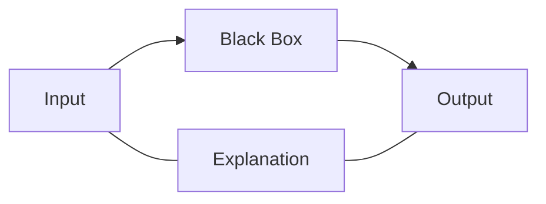

# Model Agnostic Methods

These are methods to produce explanations without relying on ML model internals, i.e. the ML model is treated like a black box.

**Example:**

- trained model
- change the data and see what effect it has on the output.

**Methods:**

- Global Explanations
    - Permutation importance
    - Partial dependence plot
- Local Methods
    - Shapely additive explanations
    - Local interpretable model agnostic explanation
    - kernelSHAP

## Global Explanation

- pros
    - it is not limited to an instance, provides a holistic view of the whole ML model.
    - It allows us to explain the outcome of any input instance.
- cons
    - Some features do not have special meaning e.g. the top right pixel in an image
    - produces an averaging effect. e.g. a feature that might have zero impact on average may be significant positively for one half of the data and negatively for the other half.

### Permutation Importance

<aside>
🗂️ By shuffling a particular column only, if the output predictions falls significantly, then we know the feature was very important and vice versa, if the feature wasn’t important then the performance does not fall.

</aside>

### Partial Dependence Plot

Partial dependence plot, sketches the functional form of the relationship between an input feature and the target.

- show the average effect on predictions as the value of feature changes.
- **Assumption:** the features of interest are independent from the complement features
- this method is applied to a model which is already trained (can be used in conjunction with permutation importance)
- use it to see “how” the predictions are changed by changes in a feature.

algorithm:

1. select a feature
2. define grid
3. per grid value:
    1. replace feature with grid value
    2. average predictions
4. draw curve

**Partial dependence plots types:**

- one way PDPs: tells us about the interaction between the target response and an input feature of interest.
- two way PDPs show the interacions among the two features.

## Local Methods

- pros
    - it allows us to analyse any anomalous behaviour of the model on a given instance.
    - provides more detailed information on why a particular output was learned for an input.
- cons
    - are only limited to explain one input instance, and the same explanation may not be true for another input.
    - can be even more computationally expensive (even exponentially more expensive in the size of the training set)